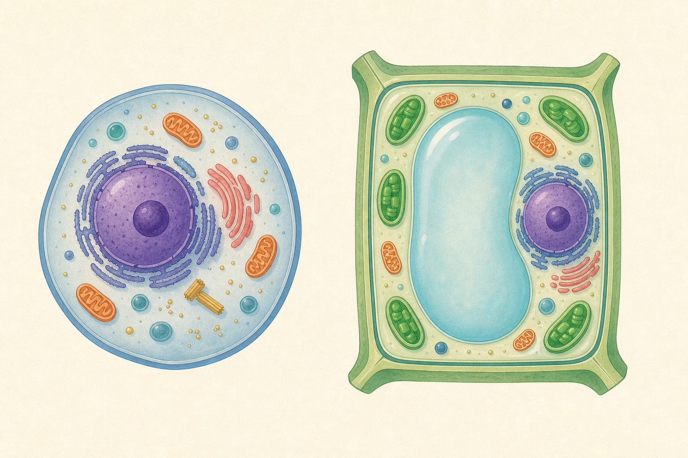

[← 生物の目次](./README.md)

# 細胞

## この単元でつかむこと

- 細胞
- 植物細胞と動物細胞の共通部分
- 植物細胞に特徴的な構造
- 核（細胞）
- 細胞膜と細胞壁の違い
- 葉緑体
- 単細胞生物と多細胞生物

*動物細胞と植物細胞の共通点と相違点を比べる概念図であり、各構造の大きさや数は模式的なので、正確な説明は本文を基準にしてください。*

## カード構成

8枚（用語4・比較4）

## 読み進め方

表を見て答えを思い浮かべた後、裏の第一文で核を確認し、続く説明で理由・比較・実験条件を補います。最後の「つながり」から少なくとも一語を選び、関係を一文で説明してください。

| 表 | 裏 |
|---|---|
| 細胞 | 生物の体をつくる基本単位。1個の細胞で生活する単細胞生物も、多数の細胞からなる多細胞生物もいる。細胞は成長・呼吸など生命活動の場でもある。**関連語：**単細胞生物／多細胞生物／核／細胞質 |
| 植物細胞と動物細胞の共通部分 | どちらにも核・細胞質・細胞膜がある。核には遺伝情報があり、細胞膜は物質の出入りを調節する。植物細胞だけの構造と混同しない。**関連語：**核／細胞質／細胞膜／遺伝子 |
| 植物細胞に特徴的な構造 | 細胞壁・葉緑体・発達した液胞が目立つ。細胞壁は形を支え、葉緑体は光合成を行い、液胞には細胞液が入る。根など光合成しない植物細胞には葉緑体がない場合もある。**関連語：**細胞壁／葉緑体／液胞／植物細胞 |
| 核（細胞） | 細胞内にあり、染色体を通して遺伝情報をもつ構造。酢酸カーミン液や酢酸オルセイン液などで染まりやすい。成熟したヒトの赤血球のように核を失う細胞もある。**関連語：**染色体／DNA／遺伝子／細胞分裂 |
| 細胞膜と細胞壁の違い | 細胞膜は動植物細胞の両方にあり、細胞の内外を仕切って物質の出入りを調節する。細胞壁は植物細胞などで細胞膜の外側にあり、丈夫で形を支える。**関連語：**細胞膜／細胞壁／植物細胞／動物細胞 |
| 葉緑体 | 植物の緑色の部分の細胞に多く、葉緑素を含んで光合成を行う。すべての植物細胞にあるわけではなく、タマネギの鱗片葉や根の細胞には通常見られない。**関連語：**光合成／葉緑素／植物細胞／デンプン |
| 液胞 | 細胞液を含む袋状の構造。成熟した植物細胞では大きく発達し、水や色素・不要物などを蓄え、細胞の張りにも関わる。動物細胞では目立つ大きな液胞はない。**関連語：**細胞液／植物細胞／細胞質／浸透 |
| 単細胞生物と多細胞生物 | 単細胞生物は1個の細胞で生命活動をすべて行う。多細胞生物では細胞が分業し、同じ形・はたらきの細胞が組織、組織が器官、器官が個体をつくる。**関連語：**組織／器官／個体／細胞 |
