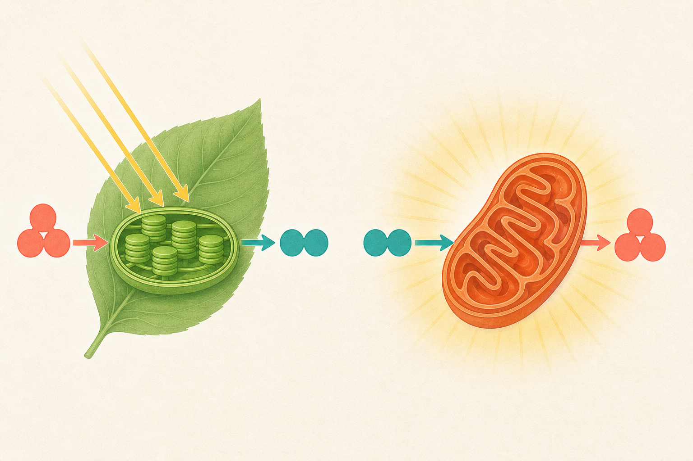

[← 生物の目次](./README.md)

# 光合成と呼吸

## この単元でつかむこと

- 光合成の物質の出入り
- 植物の呼吸
- BTB溶液で光合成を調べる
- 水草の気泡実験の注意

*植物も呼吸することを含めて光合成と呼吸の関係を示す概念図であり、粒子・矢印・構造の尺度は模式的なので、正確な説明は本文を基準にしてください。*

## カード構成

6枚（因果1・誤解対策1・計算1・実験3）

## 読み進め方

表を見て答えを思い浮かべた後、裏の第一文で核を確認し、続く説明で理由・比較・実験条件を補います。最後の「つながり」から少なくとも一語を選び、関係を一文で説明してください。

| 表 | 裏 |
|---|---|
| 光合成の物質の出入り | 二<ruby>酸化<rt>さんか</rt></ruby>炭素＋水→有機物（デンプンなど）＋酸素、という向きで捉える。光エネルギーを化学エネルギーとして有機物に蓄える反応で、葉緑体で行われる。**つながり：**二酸化炭素／水／酸素／有機物 |
| 植物の呼吸 | 植物も昼夜を通して、細胞で有機物と酸素を使い、二<ruby>酸化<rt>さんか</rt></ruby>炭素と水を生じながらエネルギーを取り出す。昼は光合成量が呼吸量を上回りやすく、見かけ上は二酸化炭素を吸収する。**つながり：**細胞呼吸／光合成／酸素／二酸化炭素 |
| 光合成量・呼吸量・見かけの光合成量 | 見かけの光合成量＝真の光合成量－呼吸量。したがって、真の光合成量＝見かけの光合成量＋呼吸量。明所で放出された酸素だけを真の光合成量としない。**つながり：**光合成／呼吸／酸素／補償点 |
| BTB溶液で光合成を調べる | BTB溶液は二<ruby>酸化<rt>さんか</rt></ruby>炭素が多く酸性寄りだと黄色、中性付近で緑、少ないと青になる。水草を明所に置いて青方向なら光合成で二酸化炭素が減ったと判断する。色は酸素量を直接示さない。**つながり：**BTB溶液／二酸化炭素／水草／光合成 |
| 水草の気泡実験の注意 | 明所の水草から出る気泡は主に光合成で生じた酸素。光の強さ・温度・二<ruby>酸化<rt>さんか</rt></ruby>炭素濃度などを一つだけ変え、一定時間の気泡数や集めた気体量を比べる。気泡の大きさが違う点にも注意する。**つながり：**酸素／光の強さ／<ruby>対照実験<rt>たいしょうじっけん</rt></ruby>／二酸化炭素 |
| 石灰水と二<ruby>酸化<rt>さんか</rt></ruby>炭素 | 石灰水に二<ruby>酸化<rt>さんか</rt></ruby>炭素を通すと炭酸カルシウムが生じて白く濁る。発芽種子や動物の呼吸で二酸化炭素が出ることを確かめられる。長時間過剰に通すと濁りが消えることがある。**つながり：**石灰水／呼吸／二酸化炭素／炭酸カルシウム |
