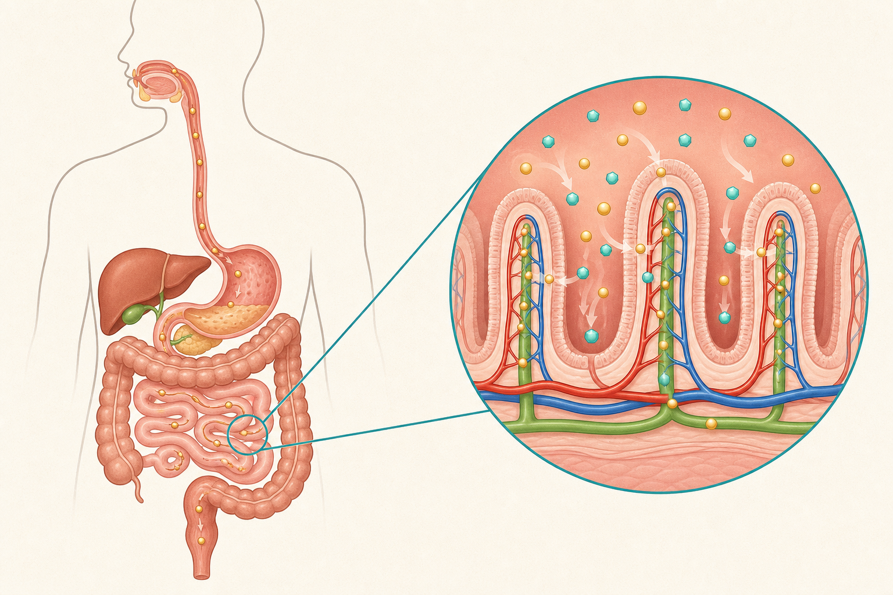

[← 生物の目次](./README.md)

# 消化と吸収

## この単元でつかむこと

- 三大栄養素
- 消化管の順序
- <ruby>消化酵素<rt>しょうかこうそ</rt></ruby>
- だ液のはたらき
- だ液の実験で温度をそろえる理由
- <ruby>胆汁<rt>たんじゅう</rt></ruby>のはたらき
- <ruby>膵液<rt>すいえき</rt></ruby>のはたらき
- 小腸での消化と吸収
- <ruby>絨毛<rt>じゅうもう</rt></ruby>
- 肝臓の主なはたらき

*消化管の連続性と小腸の絨毛での吸収を示す概念図であり、器官・絨毛・養分粒子の大きさや配置は模式的なので、正確な説明は本文を基準にしてください。*

## カード構成

13枚（用語9・実験1・誤解対策1・比較2）

## 読み進め方

表を見て答えを思い浮かべた後、裏の第一文で核を確認し、続く説明で理由・比較・実験条件を補います。最後の「つながり」から少なくとも一語を選び、関係を一文で説明してください。

| 表 | 裏 |
|---|---|
| 三大栄養素 | 炭水化物・タンパク質・脂肪。消化後、炭水化物は主にブドウ糖、タンパク質はアミノ酸、脂肪は脂肪酸とモノグリセリドなどとして吸収される。ビタミン・無機物・水は基本的に消化せず吸収できる。**つながり：**ブドウ糖／アミノ酸／脂肪酸／消化 |
| 消化管の順序 | 口→食道→胃→小腸→大腸→肛門と続く一本の管。肝臓・<ruby>膵臓<rt>すいぞう</rt></ruby>・だ液腺は消化液をつくるが、食物がその内部を通る消化管ではない。**つながり：**口／胃／小腸／大腸 |
| <ruby>消化酵素<rt>しょうかこうそ</rt></ruby> | 消化液に含まれ、特定の栄養素を体温程度の温度で分解する物質。自身は反応の前後でほとんど変化せず、少量ではたらく。酵素ごとにはたらく相手が決まっている。**つながり：**アミラーゼ／ペプシン／リパーゼ／消化液 |
| だ液のはたらき | だ液中のアミラーゼがデンプンを麦芽糖などへ分解する。デンプンの消失はヨウ素液、糖の生成はベネジクト液を加え、試験管の口を人へ向けず熱湯浴で加熱して赤褐色の<ruby>沈殿<rt>ちんでん</rt></ruby>ができるかで調べる。**つながり：**アミラーゼ／デンプン／ヨウ素液／ベネジクト液 |
| だ液の実験で温度をそろえる理由 | 酵素のはたらきは温度に左右されるため、だ液あり・なし以外を同じ条件にする。体温に近い約40℃の湯で一定時間保ち、水だけの試験管を対照にする。沸騰させると酵素が変性する。**つながり：**<ruby>対照実験<rt>たいしょうじっけん</rt></ruby>／アミラーゼ／温度／変性 |
| 胃液のはたらき | 胃液には塩酸とペプシンが含まれ、強い酸性の環境でタンパク質の消化を進める。胃壁は粘液で守られる。胃で全栄養素の消化が完了するわけではない。**つながり：**ペプシン／タンパク質／塩酸／胃 |
| <ruby>胆汁<rt>たんじゅう</rt></ruby>のはたらき | 肝臓でつくられ胆のうに蓄えられ、小腸へ出る。脂肪を細かい粒にして水と混ざりやすくし、リパーゼの作用を助けるが、胆汁自体には<ruby>消化酵素<rt>しょうかこうそ</rt></ruby>を含まない。**つながり：**肝臓／胆のう／脂肪／リパーゼ |
| <ruby>膵液<rt>すいえき</rt></ruby>のはたらき | 膵臓でつくられ小腸へ出る。炭水化物・タンパク質・脂肪を分解する複数の<ruby>消化酵素<rt>しょうかこうそ</rt></ruby>を含む。1種類の酵素がすべてを分解するわけではない。**つながり：**膵臓／アミラーゼ／トリプシン／リパーゼ |
| 小腸での消化と吸収 | すい液・胆汁・腸液などで消化が仕上がり、絨毛から養分が吸収される。ブドウ糖とアミノ酸は主に毛細血管へ、脂肪の分解産物は吸収後に再合成され主にリンパ管へ入る。**つながり：**絨毛／毛細血管／リンパ管／吸収 |
| <ruby>絨毛<rt>じゅうもう</rt></ruby> | 小腸内壁に多数ある突起。表面積を非常に大きくし、内部の毛細血管やリンパ管へ効率よく養分を吸収する。『消化する突起』ではなく、主な役割は吸収である。**つながり：**小腸／表面積／毛細血管／リンパ管 |
| 大腸の主なはたらき | 消化されなかった内容物から水や一部の無機物を吸収し、便を形成する。養分吸収の中心は小腸であり、大腸ではない。腸内細菌も生息する。**つながり：**水分吸収／小腸／便／腸内細菌 |
| 肝臓の主なはたらき | 胆汁をつくる、吸収したブドウ糖をグリコーゲンとして蓄える、有害物質を分解する、アンモニアを<ruby>尿素<rt>にょうそ</rt></ruby>に変えるなど。消化液が直接通る消化管ではない。**つながり：**胆汁／グリコーゲン／尿素／解毒 |
| 栄養素の消化・吸収の比較 | 栄養素／主な消化液・酵素／最終産物／主な吸収先／ デンプン／だ液・膵液のアミラーゼ、腸液の酵素／ブドウ糖／毛細血管／ タンパク質／胃液のペプシン、膵液のトリプシン、腸液の酵素／アミノ酸／毛細血管／ 脂肪／胆汁で乳化後、膵液のリパーゼ／脂肪酸とモノグリセリドなど／主にリンパ管／ 胆汁自体は<ruby>消化酵素<rt>しょうかこうそ</rt></ruby>を含まず、吸収は主に小腸の絨毛で行われる。**つながり：**消化酵素／絨毛／毛細血管／リンパ管 |
