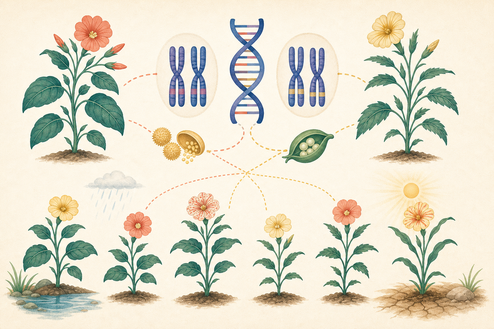

[← 生物の目次](./README.md)

# 遺伝

## この単元でつかむこと

- 遺伝と形質
- 対立形質
- <ruby>顕性形質<rp>（</rp><rt>けんせいけいしつ</rt><rp>）</rp></ruby>と<ruby>潜性形質<rp>（</rp><rt>せんせいけいしつ</rt><rp>）</rp></ruby>
- 分離の法則
- 一遺伝子雑種のF1
- F2の遺伝子型と表現型の比
- 遺伝の確率問題

*遺伝情報と形質の受け継がれ方・ばらつきを結ぶ概念図であり、組み合わせや環境の表現は模式的で尺度どおりではないため、正確な説明は本文を基準にしてください。*

## カード構成

10枚（用語4・誤解対策2・計算3・因果1）

## 読み進め方

表を見て答えを思い浮かべた後、裏の第一文で核を確認し、続く説明で理由・比較・実験条件を補います。最後の「つながり」から少なくとも一語を選び、関係を一文で説明してください。

| 表 | 裏 |
|---|---|
| 遺伝と形質 | 親の形質が子へ伝わる現象が遺伝。生物の形や性質の特徴を形質という。形質は遺伝子だけでなく環境の影響も受けるため、同じ遺伝情報でも完全に同じになるとは限らない。**関連語：**形質／遺伝子／環境／DNA |
| 対立形質 | 同じ形質について、区別して比べる対になる現れ方。エンドウの種子の形が丸かしわか、など。単に反対語なら何でも対立形質というわけではない。後続の3:1などの比は、一方だけが現れる完全顕性を仮定する。**関連語：**形質／優性形質／劣性形質／エンドウ |
| <ruby>顕性形質<rp>（</rp><rt>けんせいけいしつ</rt><rp>）</rp></ruby>と<ruby>潜性形質<rp>（</rp><rt>せんせいけいしつ</rt><rp>）</rp></ruby> | 対立遺伝子を1つずつもつ個体で現れる形質を<ruby>顕性<rp>（</rp><rt>けんせい</rt><rp>）</rp></ruby>、現れない方を<ruby>潜性<rp>（</rp><rt>せんせい</rt><rp>）</rp></ruby>という。旧称は優性・劣性。生存上『優れている・劣っている』という意味ではない。**関連語：**対立遺伝子／遺伝子型／表現型／メンデル |
| 純系 | 自家受精などを何代繰り返しても同じ形質の子だけを生じる系統。ある形質について同じ対立遺伝子を2つもつ。メンデルは純系どうしを交配して規則性を調べた。**関連語：**自家受精／対立遺伝子／メンデル／交配 |
| 分離の法則 | 対になっている対立遺伝子は、生殖細胞ができるときに分かれ、各生殖細胞には一方だけが入る。受精で再び対になる。子の比を求める土台。**関連語：**対立遺伝子／生殖細胞／受精／遺伝子型 |
| 一遺伝子雑種のF1 | 純系AAと純系aaを交配すると、F1はすべてAaとなり<ruby>顕性形質<rp>（</rp><rt>けんせいけいしつ</rt><rp>）</rp></ruby>を示す。『顕性遺伝子だけを受け継ぐ』のではなく、<ruby>潜性<rp>（</rp><rt>せんせい</rt><rp>）</rp></ruby>のaももっている。**関連語：**純系／F1／顕性形質／遺伝子型 |
| F2の遺伝子型と表現型の比 | F1どうしAa×Aaでは、遺伝子型AA:Aa:aa＝1:2:1、完全顕性なら表現型は<ruby>顕性<rp>（</rp><rt>けんせい</rt><rp>）</rp></ruby>:<ruby>潜性<rp>（</rp><rt>せんせい</rt><rp>）</rp></ruby>＝3:1。個体数が少ない実験では実測値が厳密な比からずれる。**関連語：**F2／遺伝子型／表現型／分離の法則 |
| <ruby>検定交雑<rp>（</rp><rt>けんていこうざつ</rt><rp>）</rp></ruby>の考え方 | <ruby>顕性形質<rp>（</rp><rt>けんせいけいしつ</rt><rp>）</rp></ruby>の個体がAAかAaか調べるには、<ruby>潜性<rp>（</rp><rt>せんせい</rt><rp>）</rp></ruby>のaaと交配する。子に<ruby>潜性形質<rp>（</rp><rt>せんせいけいしつ</rt><rp>）</rp></ruby>が現れれば親はAa。すべて<ruby>顕性<rp>（</rp><rt>けんせい</rt><rp>）</rp></ruby>でも、子の数が少ない場合はAAと断定しきれない。**関連語：**顕性形質／潜性形質／遺伝子型／交配 |
| 遺伝の確率問題 | 各子がある形質になる確率は、通常それぞれ独立に考える。確率1/4だから4匹産まれれば必ず1匹という意味ではない。配偶子の組み合わせ表を作ると整理しやすい。**関連語：**確率／分離の法則／配偶子／組み合わせ表 |
| <ruby>有性生殖<rp>（</rp><rt>ゆうせいせいしょく</rt><rp>）</rp></ruby>が多様性を生む理由 | 両親由来の遺伝子が生殖細胞形成と受精で組み合わされ、子ごとに異なる組み合わせが生じるため。環境変化に強い個体を含む可能性が増え、集団の存続に有利になりうる。**関連語：**有性生殖／遺伝的多様性／受精／自然選択 |
