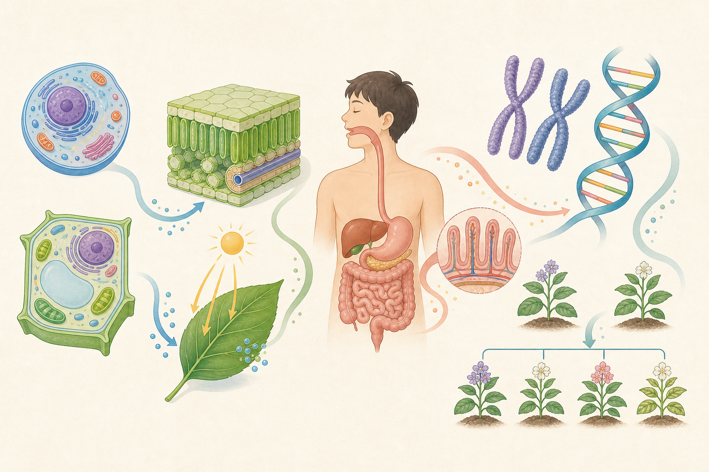

# 生物

生物は、細胞を基本単位として、組織・器官・個体・生態系へ階層が広がります。形だけでなく、その形がどの働きを支えるかをセットで理解します。

光合成と呼吸、消化と吸収、刺激と反応、遺伝と生殖は、物質・エネルギー・情報の流れとして結び付けます。

*生物の階層と物質・エネルギー・情報の流れを結ぶ概念図であり、構造の大きさや配置は模式的なので、正確な説明は本文を基準にしてください。*

## この領域の単元

- [観察器具](./01_観察器具.md)（1枚）
- [植物の一生](./02_植物の一生.md)（1枚）
- [昆虫](./03_昆虫.md)（2枚）
- [季節と生物](./04_季節と生物.md)（1枚）
- [人体](./05_人体.md)（6枚）
- [種子の発芽](./06_種子の発芽.md)（2枚）
- [種子のつくり](./07_種子のつくり.md)（2枚）
- [植物の成長](./08_植物の成長.md)（1枚）
- [花と実](./09_花と実.md)（3枚）
- [動物の成長](./10_動物の成長.md)（2枚）
- [根のはたらき](./11_根のはたらき.md)（1枚）
- [茎のはたらき](./12_茎のはたらき.md)（1枚）
- [葉のはたらき](./13_葉のはたらき.md)（1枚）
- [光合成](./14_光合成.md)（3枚）
- [蒸散](./15_蒸散.md)（4枚）
- [生態系](./16_生態系.md)（14枚）
- [生命の共通性](./17_生命の共通性.md)（1枚）
- [動物の分類](./18_動物の分類.md)（12枚）
- [顕微鏡](./19_顕微鏡.md)（6枚）
- [植物の分類](./20_植物の分類.md)（9枚）
- [無脊椎動物](./21_無脊椎動物.md)（5枚）
- [細胞](./22_細胞.md)（8枚）
- [植物の体](./23_植物の体.md)（7枚）
- [光合成と呼吸](./24_光合成と呼吸.md)（6枚）
- [植物の物質移動](./25_植物の物質移動.md)（2枚）
- [植物の反応](./26_植物の反応.md)（1枚）
- [体の階層](./27_体の階層.md)（1枚）
- [消化と吸収](./28_消化と吸収.md)（13枚）
- [呼吸](./29_呼吸.md)（5枚）
- [血液循環](./30_血液循環.md)（5枚）
- [血液](./31_血液.md)（4枚）
- [排出](./32_排出.md)（3枚）
- [神経系](./33_神経系.md)（4枚）
- [感覚器官](./34_感覚器官.md)（2枚）
- [運動器官](./35_運動器官.md)（2枚）
- [進化](./36_進化.md)（3枚）
- [生殖](./37_生殖.md)（7枚）
- [細胞分裂](./38_細胞分裂.md)（4枚）
- [成長](./39_成長.md)（1枚）
- [遺伝情報](./40_遺伝情報.md)（1枚）
- [植物の生殖](./41_植物の生殖.md)（2枚）
- [遺伝](./42_遺伝.md)（10枚）
- [環境調査](./43_環境調査.md)（2枚）
- [環境保全](./44_環境保全.md)（2枚）
- [観察の方法](./45_観察の方法.md)（1枚）

## 最初に固める核

- ルーペの使い方
- 昆虫の体のつくり
- 完全変態と不完全変態
- 骨と筋肉による運動
- 発芽
- 発芽条件を調べる実験
- <ruby>子葉<rp>（</rp><rt>しよう</rt><rp>）</rp></ruby>
- 種子に蓄えられた養分
- 発芽後に植物が大きくなる条件
- 花の基本的なつくり
- 受粉
- 果実と種子のでき方
- 人の誕生まで
- 根の主な役割（小学校）
- 茎の主な役割（小学校）
- 葉の主な役割
- 日光と葉のでんぷん
- 葉にできたデンプンの調べ方
- 葉の一部をアルミニウム箔で覆う理由
- 植物に取り入れられた水の行方
- 食べる・食べられる関係
- 呼吸の目的
- 吸う息と吐く息の違い
- 消化の目的

## 学び方

1. 優先度Aを先に学び、説明を自分の言葉で言い直す。
2. 関連語を三つたどり、別カードとの因果・比較を口頭で結ぶ。
3. 実験・読図・計算カードで、知識を新しい場面に使う。
4. 間違えたときは正答だけでなく、誤った判断の根拠を修正する。
