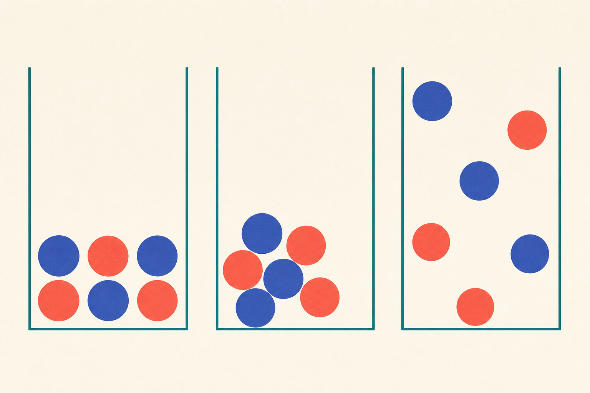

[← 化学の目次](./README.md)

# 物質の状態

## この単元でつかむこと

- 固体・液体・気体
- 状態変化
- 蒸発
- <ruby>沸騰<rp>（</rp><rt>ふっとう</rt><rp>）</rp></ruby>
- 状態変化の粒子モデル
- 状態変化と質量
- 状態変化と体積
- <ruby>融解<rp>（</rp><rt>ゆうかい</rt><rp>）</rp></ruby>と<ruby>凝固<rp>（</rp><rt>ぎょうこ</rt><rp>）</rp></ruby>
- 気化と液化
- 加熱曲線

*同じ粒子が固体・液体・気体でどのように並ぶかを示す模式図で、粒子の大きさや間隔は実際の尺度ではありません。*

## カード構成

11枚（比較5・用語2・因果1・誤解対策2・読図1）

## 読み進め方

表を見て答えを思い浮かべた後、裏の第一文で核を確認し、続く説明で理由・比較・実験条件を補います。最後の「つながり」から少なくとも一語を選び、関係を一文で説明してください。

| 表 | 裏 |
|---|---|
| 固体・液体・気体 | 固体は形と体積がほぼ一定、液体は体積がほぼ一定で容器に合わせて形が変わり、気体は形も体積も容器全体へ広がる。同じ物質でも温度で状態が変わる。**関連語：**状態変化／粒子／温度 |
| 状態変化 | 物質が温度によって固体・液体・気体の間を変わること。物質の種類は変わらないので物理変化であり、基本的に全体の質量も変わらない。**関連語：**<ruby>融解<rp>（</rp><rt>ゆうかい</rt><rp>）</rp></ruby>／気化／<ruby>凝固<rp>（</rp><rt>ぎょうこ</rt><rp>）</rp></ruby> |
| 蒸発 | 液体の表面から粒子が飛び出して気体になる現象で、<ruby>沸点<rp>（</rp><rt>ふってん</rt><rp>）</rp></ruby>より低い温度でも起こる。温度が高い、表面積が大きい、風がある、湿度が低いほど速く進む。**関連語：**気化／湿度／表面積 |
| <ruby>沸騰<rp>（</rp><rt>ふっとう</rt><rp>）</rp></ruby> | 液体内部からも気泡が生じ、液体全体で気化する現象。<ruby>沸点<rp>（</rp><rt>ふってん</rt><rp>）</rp></ruby>は物質と気圧で決まり、純物質では沸騰中の温度がほぼ一定。水中の気泡は空気とは限らず主に水蒸気。**関連語：**沸点／水蒸気／気圧 |
| 状態変化の粒子モデル | 固体では粒子が規則的に並びその場で振動し、液体では近接したまま動き、気体では離れて自由に動く。状態変化で粒子そのものの種類や個数は変わらない。**関連語：**粒子／状態変化／熱運動 |
| 状態変化と質量 | 密閉した容器内では、状態が変わっても粒子の種類と数が同じなので全体の質量は変わらない。開放容器で液体が減るのは、気体となって外へ出たため。**関連語：**質量保存／蒸発／密閉系 |
| 状態変化と体積 | 一般に固体→液体→気体で体積は大きくなり、特に気体で大きい。水は例外的に凍ると体積が増えるため、氷の密度は水より小さく浮く。質量は変わらない。**関連語：**密度／氷／質量保存 |
| <ruby>融解<rp>（</rp><rt>ゆうかい</rt><rp>）</rp></ruby>と<ruby>凝固<rp>（</rp><rt>ぎょうこ</rt><rp>）</rp></ruby> | 固体が液体になるのが融解、液体が固体になるのが凝固。純物質では一定圧力下で<ruby>融点<rp>（</rp><rt>ゆうてん</rt><rp>）</rp></ruby>と凝固点は同じ温度になり、変化中は加熱・冷却しても温度がほぼ一定。**関連語：**融点／状態変化／加熱曲線 |
| 気化と液化 | 液体が気体になるのが気化、気体が液体になるのが液化。気化には液面で起こる蒸発と、液体内部からも起こる<ruby>沸騰<rp>（</rp><rt>ふっとう</rt><rp>）</rp></ruby>がある。液化では熱を周囲へ放出する。**関連語：**蒸発／沸騰／<ruby>凝結<rp>（</rp><rt>ぎょうけつ</rt><rp>）</rp></ruby> |
| 加熱曲線 | 純物質を一定の割合で加熱すると、状態変化中は加えた熱が粒子間の結びつきを変えるため温度がほぼ一定になる。水平部分の温度から<ruby>融点<rp>（</rp><rt>ゆうてん</rt><rp>）</rp></ruby>・<ruby>沸点<rp>（</rp><rt>ふってん</rt><rp>）</rp></ruby>を読む。**関連語：**融点／沸点／潜熱 |
| 純物質と混合物の加熱曲線 | 純物質は<ruby>融解<rp>（</rp><rt>ゆうかい</rt><rp>）</rp></ruby>・沸騰中の温度が一定になりやすい。混合物は組成が変化しながら状態変化するため、温度が一定にならないことが多い。水平部分の有無が手がかり。**関連語：**純物質／混合物／<ruby>沸点<rp>（</rp><rt>ふってん</rt><rp>）</rp></ruby> |
