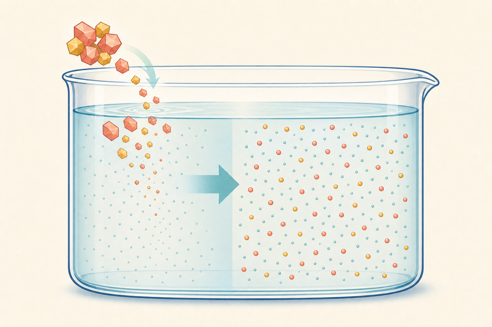

[← 化学の目次](./README.md)

# 水溶液

## この単元でつかむこと

- 溶ける
- 水溶液の均一性と透明性
- 溶解と質量保存
- 蒸発による取り出し
- 結晶
- <ruby>溶質<rp>（</rp><rt>ようしつ</rt><rp>）</rp></ruby>・<ruby>溶媒<rp>（</rp><rt>ようばい</rt><rp>）</rp></ruby>・溶液
- ろ過
- <ruby>溶解度<rp>（</rp><rt>ようかいど</rt><rp>）</rp></ruby>
- <ruby>飽和水溶液<rp>（</rp><rt>ほうわすいようえき</rt><rp>）</rp></ruby>
- 溶解度曲線
- 冷却で出る結晶の質量
- <ruby>再結晶<rp>（</rp><rt>さいけっしょう</rt><rp>）</rp></ruby>
- 質量パーセント濃度
- 濃度から<ruby>溶質<rp>（</rp><rt>ようしつ</rt><rp>）</rp></ruby>を求める
- 水で薄める計算

*<ruby>溶質<rp>（</rp><rt>ようしつ</rt><rp>）</rp></ruby>が水中へ均一に広がる過程を示す模式図で、粒子の大きさや数は実際の尺度ではありません。*

## カード構成

17枚（誤解対策2・計算6・実験4・用語4・読図1）

## 読み進め方

表を見て答えを思い浮かべた後、裏の第一文で核を確認し、続く説明で理由・比較・実験条件を補います。最後の「つながり」から少なくとも一語を選び、関係を一文で説明してください。

| 表 | 裏 |
|---|---|
| 溶ける | 物質の粒子が液体中へ均一に広がり、見えない大きさで混ざること。なくなったのではなく、溶液を蒸発させれば多くの場合取り出せる。沈んだだけ、融けただけとは異なる。**関連語：**溶解／水溶液／結晶 |
| 水溶液の均一性と透明性 | <ruby>溶質<rp>（</rp><rt>ようしつ</rt><rp>）</rp></ruby>が水中へ均一に広がり、どの部分も同じ濃さの透明な液体が水溶液。色があっても透明なものがあり、「無色」とは別。温度・水量が変わらず溶解度以内なら溶質だけが沈まない。**関連語：**均一／透明／溶質 |
| 溶解と質量保存 | <ruby>溶質<rp>（</rp><rt>ようしつ</rt><rp>）</rp></ruby>を水に完全に溶かしても、溶液の質量＝溶質の質量＋水の質量。粒子が見えなくなるだけで消滅しない。こぼれたり気体が逃げたりしない条件で成り立つ。**関連語：**質量保存／粒子／水溶液 |
| 蒸発による取り出し | 溶液から<ruby>溶媒<rp>（</rp><rt>ようばい</rt><rp>）</rp></ruby>を気化させ、<ruby>溶質<rp>（</rp><rt>ようしつ</rt><rp>）</rp></ruby>を残す操作。食塩水から食塩を得られる。強く加熱すると飛散するため、少量になったら弱め、蒸発皿を冷ましてから扱う。**関連語：**結晶／気化／溶質 |
| 結晶 | 原子・分子・イオンなどが規則正しく並んだ固体。水溶液を冷やす、または水を蒸発させて<ruby>溶質<rp>（</rp><rt>ようしつ</rt><rp>）</rp></ruby>を取り出すとできる。物質ごとに特徴的な形を示すことがある。**関連語：**<ruby>再結晶<rp>（</rp><rt>さいけっしょう</rt><rp>）</rp></ruby>／<ruby>溶解度<rp>（</rp><rt>ようかいど</rt><rp>）</rp></ruby>／粒子 |
| <ruby>溶質<rp>（</rp><rt>ようしつ</rt><rp>）</rp></ruby>・<ruby>溶媒<rp>（</rp><rt>ようばい</rt><rp>）</rp></ruby>・溶液 | 溶かされる物質が溶質、溶かす液体が溶媒、均一に混ざったものが溶液。溶媒が水なら水溶液。食塩水では食塩が溶質、水が溶媒。**関連語：**水溶液／溶解／濃度 |
| ろ過 | 液体に溶けていない固体を、ろ紙を通して分ける操作。溶けた食塩などは粒子がろ紙を通るので分けられない。液面をろ紙の上端より低くし、液をガラス棒へ伝わせる。**関連語：**ろ紙／溶解／蒸発 |
| ろ過を速く正確にする方法 | ろ紙を正しく折り、水で漏斗の内面へ密着させる。漏斗の脚の先端は受器の内壁に触れさせ、液面はろ紙の上端より低くする。沈殿を静置して上澄みから流すと速い。**関連語：**ろ紙／漏斗／沈殿 |
| <ruby>溶解度<rp>（</rp><rt>ようかいど</rt><rp>）</rp></ruby> | 一定温度で水100 gに溶ける物質の最大質量。単位は通常g/水100 g。水溶液100 gあたりではない。多くの固体は温度上昇で増えるが、増え方は物質ごとに違う。**関連語：**<ruby>飽和水溶液<rp>（</rp><rt>ほうわすいようえき</rt><rp>）</rp></ruby>／溶解度曲線／<ruby>再結晶<rp>（</rp><rt>さいけっしょう</rt><rp>）</rp></ruby> |
| <ruby>飽和水溶液<rp>（</rp><rt>ほうわすいようえき</rt><rp>）</rp></ruby> | ある温度で<ruby>溶質<rp>（</rp><rt>ようしつ</rt><rp>）</rp></ruby>が限界まで溶けた水溶液。それ以上加えると溶け残る。温度を上げてさらに溶ける場合や、水を加えて不飽和にできる。底に固体があるだけでは、十分な時間・温度条件も確認する。**関連語：**<ruby>溶解度<rp>（</rp><rt>ようかいど</rt><rp>）</rp></ruby>／不飽和／結晶 |
| 溶解度曲線 | 横軸に温度、縦軸に水100 gへ溶ける最大質量を表す。曲線上が<ruby>飽和<rp>（</rp><rt>ほうわ</rt><rp>）</rp></ruby>、下側は全部溶ける範囲、上側は超過分が溶け残る。水の量が100 gでないときは比例換算する。**関連語：**<ruby>溶解度<rp>（</rp><rt>ようかいど</rt><rp>）</rp></ruby>／飽和／<ruby>再結晶<rp>（</rp><rt>さいけっしょう</rt><rp>）</rp></ruby> |
| 冷却で出る結晶の質量 | 高温の<ruby>飽和水溶液<rp>（</rp><rt>ほうわすいようえき</rt><rp>）</rp></ruby>を冷やすと、結晶質量＝高温で溶けていた質量−低温で溶けていられる質量。同じ水の質量に換算して差を取る。蒸発した水がある場合は別計算。**関連語：**溶解度曲線／<ruby>再結晶<rp>（</rp><rt>さいけっしょう</rt><rp>）</rp></ruby>／<ruby>飽和<rp>（</rp><rt>ほうわ</rt><rp>）</rp></ruby> |
| <ruby>再結晶<rp>（</rp><rt>さいけっしょう</rt><rp>）</rp></ruby> | 固体の<ruby>溶解度<rp>（</rp><rt>ようかいど</rt><rp>）</rp></ruby>が温度で変わる性質などを利用し、いったん溶かしてから結晶として取り出して精製する操作。温度による溶解度差が大きい物質ほど冷却法が有効。**関連語：**結晶／溶解度／精製 |
| 質量パーセント濃度 | 溶液全体に占める<ruby>溶質<rp>（</rp><rt>ようしつ</rt><rp>）</rp></ruby>の質量割合。濃度％＝溶質の質量÷溶液の質量×100、溶液質量＝溶質＋<ruby>溶媒<rp>（</rp><rt>ようばい</rt><rp>）</rp></ruby>。分母を水の質量にしない。**関連語：**溶質／溶液／希釈 |
| 濃度から<ruby>溶質<rp>（</rp><rt>ようしつ</rt><rp>）</rp></ruby>を求める | 溶質の質量＝溶液の質量×濃度/100。例えば8％食塩水250 gには20 gの食塩が含まれる。残り230 gが水。単位をgにそろえる。**関連語：**質量パーセント濃度／溶液／百分率 |
| 水で薄める計算 | 水を加えても<ruby>溶質<rp>（</rp><rt>ようしつ</rt><rp>）</rp></ruby>の質量は変わらない。薄めた後の溶液質量＝元の溶液＋加えた水として新しい濃度を求める。蒸発では水だけが減ると考える。**関連語：**希釈／質量パーセント濃度／溶質保存 |
| 異なる濃度の溶液を混ぜる | 同じ<ruby>溶質<rp>（</rp><rt>ようしつ</rt><rp>）</rp></ruby>で反応・沈殿・揮発がない水溶液同士なら、各溶質質量を足し、溶液質量も足す。混合後濃度＝溶質合計÷溶液合計×100。単純平均できるのは溶液質量が等しい場合。**関連語：**濃度／溶質質量／加重平均 |
