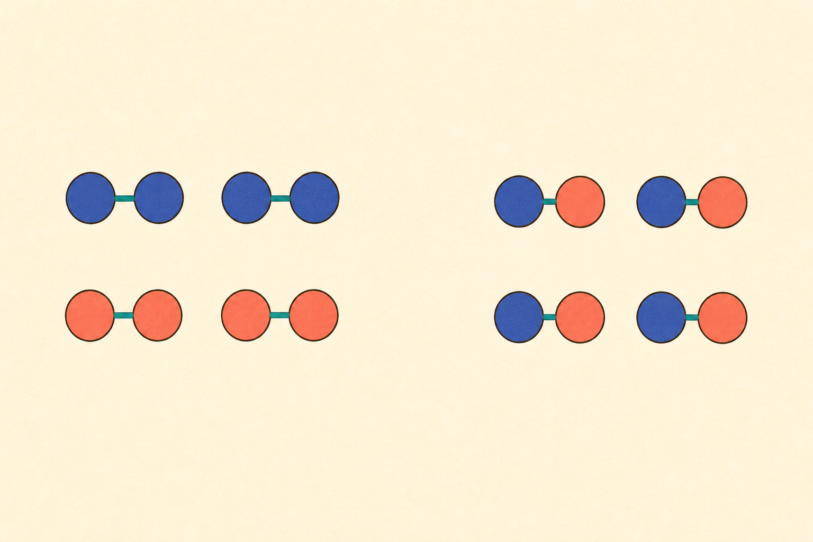

[← 化学の目次](./README.md)

# 化学変化

## この単元でつかむこと

- 物理変化と化学変化
- 化合
- 分解（化学変化）
- 化学反応式
- 化学反応式の合わせ方
- 水の生成反応
- 炭素の燃焼反応
- マグネシウムの燃焼反応
- 銅の酸化反応
- 鉄と<ruby>硫黄<rp>（</rp><rt>いおう</rt><rp>）</rp></ruby>の化合
- 酸化銀の熱分解
- 炭酸水素ナトリウムの熱分解
- 水の電気分解
- <ruby>触媒<rp>（</rp><rt>しょくばい</rt><rp>）</rp></ruby>
- 酸化
- <ruby>還元<rp>（</rp><rt>かんげん</rt><rp>）</rp></ruby>
- 酸化銅の炭素による<ruby>還元<rp>（</rp><rt>かんげん</rt><rp>）</rp></ruby>
- 発熱反応
- 化学変化と質量保存の法則
- 開放容器で質量が変わる理由
- 一定の質量比
- 銅と酸素の質量比
- マグネシウムと酸素の質量比
- 不足する反応物と余る反応物
- 反応量グラフの折れ曲がり
- 反応前後の粒子図

*原子の種類と数を保ったまま組合せが変わることを示す模式図で、結合や粒子の大きさは実際の尺度ではありません。*

## カード構成

28枚（比較1・用語9・計算4・因果1・実験8・誤解対策3・読図2）

## 読み進め方

表を見て答えを思い浮かべた後、裏の第一文で核を確認し、続く説明で理由・比較・実験条件を補います。最後の「つながり」から少なくとも一語を選び、関係を一文で説明してください。

| 表 | 裏 |
|---|---|
| 物理変化と化学変化 | 物理変化は状態や形が変わっても物質の種類が同じ。化学変化は原子の組み合わせが変わり別の物質ができる。<ruby>融解<rp>（</rp><rt>ゆうかい</rt><rp>）</rp></ruby>は物理変化、燃焼や分解は化学変化。**関連語：**状態変化／化学反応／原子 |
| 化合 | 2種類以上の物質が結びついて別の1種類の物質になる化学変化。鉄と<ruby>硫黄<rp>（</rp><rt>いおう</rt><rp>）</rp></ruby>を加熱して硫化鉄ができる反応など。単なる混合とは性質が変わる点で異なる。**関連語：**化合物／硫化鉄／分解 |
| 分解（化学変化） | 1種類の物質が2種類以上の別の物質に分かれる化学変化。加熱による熱分解や、電流による電気分解がある。状態変化のように元と同じ物質へ戻るだけではない。**関連語：**熱分解／電気分解／化合 |
| 化学反応式 | 反応物を左辺、生成物を右辺に化学式で書き矢印で結ぶ。両辺で各元素の原子数が等しくなるよう係数を最小の整数比で付ける。化学式の右下数字は変えない。**関連語：**係数／質量保存／原子数 |
| 化学反応式の合わせ方 | ①正しい化学式を書く、②複雑な物質から元素ごとに原子数を合わせる、③最後に全元素を確認、④係数を最小整数比にする。H₂＋O₂→H₂Oなら2H₂＋O₂→2H₂O。**関連語：**原子数保存／係数／化学式 |
| 水の生成反応 | 水素と酸素が反応して水ができる。2H₂＋O₂→2H₂O。分子数比は2：1：2で、各辺のH原子4個、O原子2個が保存される。**関連語：**水素／酸素／化学反応式 |
| 炭素の燃焼反応 | 炭素が十分な酸素中で燃えると二酸化炭素になる。C＋O₂→CO₂。反応後に質量が増えるように見えるのは、空気中の酸素が結びついたため。**関連語：**酸化／二酸化炭素／質量保存 |
| マグネシウムの燃焼反応 | マグネシウムが強い光を出して燃え、白色の酸化マグネシウムになる。2Mg＋O₂→2MgO。粉末などを質量測定する実験では、るつぼのふたを少しずらして加熱し、強い光を直視しない。**関連語：**酸化／酸化マグネシウム／質量比 |
| 銅の酸化反応 | 銅粉を空気中で加熱すると、酸素と結びついて黒色の酸化銅になる。2Cu＋O₂→2CuO。加熱・冷却・測定を繰り返し、質量が一定なら反応がほぼ完了したと判断する。**関連語：**酸化銅／酸化／質量増加 |
| 鉄と<ruby>硫黄<rp>（</rp><rt>いおう</rt><rp>）</rp></ruby>の化合 | 鉄粉と硫黄粉を少量混ぜ、試験管口を人へ向けず一部を加熱する。赤熱し始めたら加熱をやめても発熱して反応し、黒色のFeSができる。混合物と違い、生成物から磁石で鉄を分けられない。**関連語：**化合／硫化鉄／混合物 |
| 酸化銀の熱分解 | 黒色の酸化銀を加熱すると、銀と酸素に分解する。2Ag₂O→4Ag＋O₂。発生気体は線香の火を強くし、残った銀は金属光沢と導電性を示す。**関連語：**熱分解／酸素／銀 |
| 炭酸水素ナトリウムの熱分解 | 加熱すると炭酸ナトリウム・二酸化炭素・水になる。2NaHCO₃→Na₂CO₃＋CO₂＋H₂O。試験管の口を下げ、生成した水が加熱部へ戻り割れるのを防ぐ。**関連語：**熱分解／二酸化炭素／炭酸ナトリウム |
| 炭酸水素ナトリウムと炭酸ナトリウムの判別 | どちらも白色固体だが、水溶液へフェノールフタレイン溶液を加えると、より強いアルカリ性の炭酸ナトリウムは赤色が濃く、炭酸水素ナトリウムは薄い。水への溶け方も異なる。**関連語：**熱分解／アルカリ性／指示薬 |
| 水の電気分解 | 純水は電流を通しにくいため水酸化ナトリウムなどを少量加える。陰極に水素、陽極に酸素が体積比2：1で生じ、2H₂O→2H₂＋O₂。保護眼鏡を着け、液が付いたら直ちに多量の水で洗う。**関連語：**水素／酸素／体積比 |
| <ruby>触媒<rp>（</rp><rt>しょくばい</rt><rp>）</rp></ruby> | 反応の前後で自身はほぼ変化せず、反応速度を変える物質。二酸化マンガンは過酸化水素の分解を速めるが、できる酸素の最終総量は増やさない。少量でも働く。**関連語：**反応速度／二酸化マンガン／過酸化水素 |
| 酸化 | 中学では物質が酸素と結びつく化学変化。激しく光や熱を出す酸化が燃焼で、さびのようにゆっくり進む酸化もある。金属が酸化すると酸素分だけ質量が増える。**関連語：**燃焼／さび／<ruby>還元<rp>（</rp><rt>かんげん</rt><rp>）</rp></ruby> |
| <ruby>還元<rp>（</rp><rt>かんげん</rt><rp>）</rp></ruby> | 酸化物から酸素が取り除かれる化学変化。酸化銅と炭素を加熱すると、酸化銅は銅へ還元され、炭素は酸化されて二酸化炭素になる。酸化と還元は同時に起こる。**関連語：**酸化／酸化銅／炭素 |
| 酸化銅の炭素による<ruby>還元<rp>（</rp><rt>かんげん</rt><rp>）</rp></ruby> | 2CuO＋C→2Cu＋CO₂。黒色の酸化銅から赤色の銅ができ、気体は石灰水を濁らせる。試験管口を少し下げ、加熱を止める前にガラス管を石灰水から抜いて逆流を防ぐ。**関連語：**酸化還元／二酸化炭素／石灰水 |
| 発熱反応 | 化学変化で周囲へ熱を放出し、周囲の温度が上がる反応。燃焼、鉄の酸化、酸とアルカリの中和など。反応物の化学エネルギーの一部が熱へ変わる。**関連語：**燃焼／中和／化学エネルギー |
| 吸熱反応 | 化学変化が周囲から熱を吸収し、周囲の温度が下がる反応。例として塩化アンモニウムと水酸化バリウムの反応など。単なる氷の<ruby>融解<rp>（</rp><rt>ゆうかい</rt><rp>）</rp></ruby>は吸熱だが化学反応ではなく状態変化。**関連語：**温度低下／状態変化／化学エネルギー |
| 化学変化と質量保存の法則 | 化学変化の前後で、反応に関わる物質全体の質量は変わらない。原子の種類と数が保存され、組み合わせだけが変わるため。気体も含めた閉じた系で測る。**関連語：**原子数保存／密閉系／化学反応式 |
| 開放容器で質量が変わる理由 | 気体が外へ逃げる反応では容器内の測定質量が減り、空気中の酸素を取り込む反応では増える。容器と出入りした気体まで含めれば全体の質量は保存される。**関連語：**質量保存／気体／酸化 |
| 一定の質量比 | 同じ化合物をつくる元素の質量比は常に一定。例えば銅と酸素が酸化銅になる質量比は約4：1、マグネシウムと酸素は約3：2。反応物の量を増やしても比は変わらない。**関連語：**定比例／酸化銅／酸化マグネシウム |
| 銅と酸素の質量比 | 銅：結びつく酸素：酸化銅＝4：1：5。銅8.0 gが完全に反応すれば酸素2.0 gと結びつき酸化銅10.0 gになる。問題中の実験値から比を確定する。**関連語：**酸化銅／質量保存／比例計算 |
| マグネシウムと酸素の質量比 | マグネシウム：結びつく酸素：酸化マグネシウム＝3：2：5。Mg 6.0 gならO 4.0 gと反応しMgO 10.0 g。実験では未反応や散逸でずれることがある。**関連語：**酸化マグネシウム／質量比／燃焼 |
| 不足する反応物と余る反応物 | 一定の質量比より一方を多く混ぜても、少ない側を使い切った時点で反応は止まり、もう一方が余る。生成物量は不足する側の量で決まる。**関連語：**限界反応物／質量比／生成物 |
| 反応量グラフの折れ曲がり | 一方の反応物を一定にして他方を増やすと、生成物量は比例して増え、一定点から増えなくなる。折れ曲がりは一定側を使い切るのに必要な量で、それ以降の追加分は余る。**関連語：**限界反応物／比例／質量比 |
| 反応前後の粒子図 | 反応前後で各元素の原子の種類と総数を一致させる。原子の結びつきは変えてよいが、原子を新しく作る・消す・別元素へ変えることはできない。余った粒子も図に残す。**関連語：**原子数保存／化学反応式／余剰反応物 |
