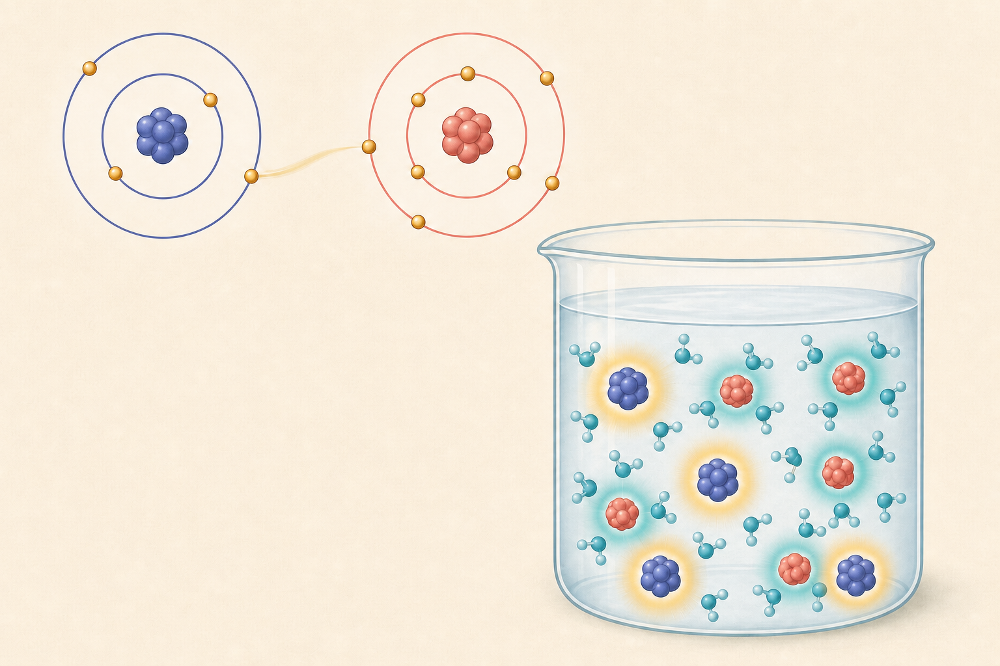

[← 化学の目次](./README.md)

# イオン

## この単元でつかむこと

- イオン
- 陽イオン
- 陰イオン
- 原子がイオンになるときの電子
- 電解質と非電解質
- <ruby>電離<rp>（</rp><rt>でんり</rt><rp>）</rp></ruby>
- 塩化水素の<ruby>電離<rp>（</rp><rt>でんり</rt><rp>）</rp></ruby>
- 水酸化ナトリウムの<ruby>電離<rp>（</rp><rt>でんり</rt><rp>）</rp></ruby>
- 金属のイオンへのなりやすさ
- Mg・Zn・Fe・Cu・Agのイオン化順
- 金属と金属イオンの置換条件
- <ruby>亜鉛<rp>（</rp><rt>あえん</rt><rp>）</rp></ruby>と硫酸銅水溶液の反応

*電子の移動と水中に分散したイオンを色と光彩で表す概念図で、電荷や水和の正確な説明は本文を基準とします。*

## カード構成

17枚（用語10・誤解対策1・比較4・因果1・実験1）

## 読み進め方

表を見て答えを思い浮かべた後、裏の第一文で核を確認し、続く説明で理由・比較・実験条件を補います。最後の「つながり」から少なくとも一語を選び、関係を一文で説明してください。

| 表 | 裏 |
|---|---|
| イオン | 原子や原子団が電子を失ったり受け取ったりして電気を帯びた粒子。電子を失うと陽イオン、受け取ると陰イオン。原子核の陽子数は化学変化では変わらない。**関連語：**陽イオン／陰イオン／電子 |
| 陽イオン | 原子などが電子を失い、正の電気を帯びた粒子。Na⁺、H⁺、Cu²⁺、NH₄⁺など。右上の数字は電荷の大きさで、原子の個数ではない。**関連語：**電子放出／陰イオン／<ruby>電離<rp>（</rp><rt>でんり</rt><rp>）</rp></ruby> |
| 陰イオン | 原子などが電子を受け取り、負の電気を帯びた粒子。Cl⁻、OH⁻、SO₄²⁻など。マイナスは「電子が少ない」のではなく、陽子より電子が多い状態。**関連語：**電子受容／陽イオン／<ruby>電離<rp>（</rp><rt>でんり</rt><rp>）</rp></ruby> |
| 原子がイオンになるときの電子 | ナトリウム原子は電子1個を失いNa⁺、塩素原子は電子1個を受け取りCl⁻。イオンになるのは電子の出入りであり、陽子や中性子が移動するのではない。**関連語：**Na+／Cl-／電子移動 |
| 重要な陽イオン（一覧） | 1価はH⁺・Na⁺・K⁺・Ag⁺・NH₄⁺、2価はCu²⁺・Mg²⁺・Ca²⁺・Zn²⁺・Ba²⁺。名称と式を個別カードで覚えた後、電荷ごとに総復習する。**関連語：**陽イオン／電荷／<ruby>電離<rp>（</rp><rt>でんり</rt><rp>）</rp></ruby> |
| 重要な陰イオン（一覧） | 塩化物イオンCl⁻、水酸化物イオンOH⁻、硫酸イオンSO₄²⁻、硝酸イオンNO₃⁻、炭酸イオンCO₃²⁻。複数原子からなるものは原子団全体で1つのイオン。個別カード習得後の総復習に使う。**関連語：**<ruby>電離<rp>（</rp><rt>でんり</rt><rp>）</rp></ruby>／アルカリ性／沈殿 |
| 電解質と非電解質 | 水に溶けたときイオンに分かれ、水溶液が電流を通す物質が電解質。食塩・塩酸・水酸化ナトリウムなど。砂糖やエタノールは溶けてもイオンにならず非電解質。**関連語：**<ruby>電離<rp>（</rp><rt>でんり</rt><rp>）</rp></ruby>／導電性／イオン |
| <ruby>電離<rp>（</rp><rt>でんり</rt><rp>）</rp></ruby> | 電解質が水に溶けて陽イオンと陰イオンに分かれること。NaCl→Na⁺＋Cl⁻。水溶液全体では正負の電荷総量が等しく、電気的に中性。**関連語：**電解質／陽イオン／陰イオン |
| 塩化水素の<ruby>電離<rp>（</rp><rt>でんり</rt><rp>）</rp></ruby> | 塩化水素HClが水に溶けるとH⁺とCl⁻に電離し、塩酸になる。HCl→H⁺＋Cl⁻。酸性の共通性は主にH⁺による。**関連語：**塩酸／水素イオン／酸性 |
| 水酸化ナトリウムの<ruby>電離<rp>（</rp><rt>でんり</rt><rp>）</rp></ruby> | NaOH→Na⁺＋OH⁻。水酸化ナトリウム水溶液はOH⁻を生じるためアルカリ性を示す。固体や濃い水溶液は強い腐食性があるので皮膚に付けない。**関連語：**水酸化物イオン／アルカリ性／中和 |
| 硫酸の<ruby>電離<rp>（</rp><rt>でんり</rt><rp>）</rp></ruby> | H₂SO₄→2H⁺＋SO₄²⁻。硫酸1個分からH⁺が2個分生じることと、硫酸イオンの電荷が2−であることを対応させる。**関連語：**硫酸イオン／水素イオン／酸性 |
| 水酸化カルシウムの<ruby>電離<rp>（</rp><rt>でんり</rt><rp>）</rp></ruby> | Ca(OH)₂→Ca²⁺＋2OH⁻。化学式中のかっこ外の2はOH全体が2組あることを示す。石灰水は水酸化カルシウムの<ruby>飽和水溶液<rp>（</rp><rt>ほうわすいようえき</rt><rp>）</rp></ruby>。**関連語：**水酸化物イオン／石灰水／アルカリ性 |
| 沈殿 | 水溶液中のイオン同士が結びつき、水に溶けにくい固体となって現れること。沈殿は化学変化で、ろ過により液体から分けられる。色や組み合わせがイオン判定に使われる。**関連語：**イオン／ろ過／硫酸バリウム |
| 金属のイオンへのなりやすさ | 金属原子が電子を失って陽イオンになろうとする程度。なりやすい金属ほど電子を放出しやすく、他の金属イオンへ電子を渡してその金属を<ruby>析出<rp>（</rp><rt>せきしゅつ</rt><rp>）</rp></ruby>させることがある。**関連語：**陽イオン／電子／金属の置換 |
| Mg・Zn・Fe・Cu・Agのイオン化順 | 中学でよく比べる範囲では、イオンになりやすい順にMg＞Zn＞Fe＞Cu＞Ag。左ほど電子を失いやすく、右側の金属イオンを含む水溶液から金属を<ruby>析出<rp>（</rp><rt>せきしゅつ</rt><rp>）</rp></ruby>させやすい。**関連語：**マグネシウム／<ruby>亜鉛<rp>（</rp><rt>あえん</rt><rp>）</rp></ruby>／銅イオン |
| 金属と金属イオンの置換条件 | 金属Aが金属Bよりイオンになりやすければ、AをBのイオンを含む水溶液へ入れると、Aは電子を失って溶け、Bのイオンは電子を受け取りBとして<ruby>析出<rp>（</rp><rt>せきしゅつ</rt><rp>）</rp></ruby>する。逆の組合せでは起こらない。**関連語：**電子移動／酸化還元／析出 |
| <ruby>亜鉛<rp>（</rp><rt>あえん</rt><rp>）</rp></ruby>と硫酸銅水溶液の反応 | Zn＋Cu²⁺→Zn²⁺＋Cu。亜鉛は溶け、Cu²⁺は赤色の銅として付着し、青色が薄くなる。保護眼鏡を着け、付着時は水洗いし、銅を含む廃液は流さず指定容器へ回収する。**関連語：**金属の置換／銅イオン／酸化還元 |
