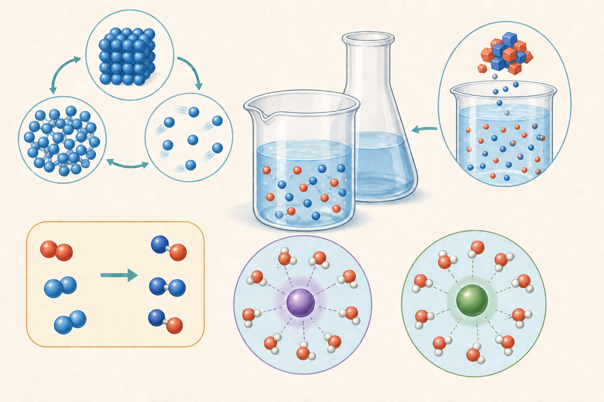

# 化学

化学は、目に見える変化を粒子の組み替えとして説明する領域です。状態変化では粒子の種類は変わらず、化学変化では原子の組合せが変わります。質量保存は、反応前後で原子の種類と数が保存されることの表れです。

気体・水溶液・化学反応式・イオンを別々にせず、『何が存在し、どこへ移り、何に変わったか』を追跡します。

*粒子・溶解・状態変化・化学変化・イオンを俯瞰する概念図で、正確な定義や条件は本文を基準とします。*

## この領域の単元

- [物質の状態](./01_物質の状態.md)（11枚）
- [水溶液](./02_水溶液.md)（17枚）
- [気体](./03_気体.md)（12枚）
- [燃焼](./04_燃焼.md)（5枚）
- [水溶液の性質](./05_水溶液の性質.md)（4枚）
- [物質の分類](./06_物質の分類.md)（4枚）
- [物質の分離](./07_物質の分離.md)（4枚）
- [気体の発生](./08_気体の発生.md)（4枚）
- [材料](./09_材料.md)（3枚）
- [状態変化](./10_状態変化.md)（1枚）
- [酸化](./11_酸化.md)（2枚）
- [粒子](./12_粒子.md)（9枚）
- [化学変化](./13_化学変化.md)（28枚）
- [元素](./14_元素.md)（2枚）
- [化学反応式](./15_化学反応式.md)（4枚）
- [元素記号](./16_元素記号.md)（16枚）
- [イオン](./17_イオン.md)（17枚）
- [酸・アルカリ](./18_酸・アルカリ.md)（7枚）
- [中和](./19_中和.md)（8枚）
- [電気分解](./20_電気分解.md)（4枚）
- [電池](./21_電池.md)（12枚）
- [原子の構造](./22_原子の構造.md)（5枚）
- [イオン式](./23_イオン式.md)（15枚）
- [実験操作](./24_実験操作.md)（2枚）

## 最初に固める核

- 固体・液体・気体
- 状態変化
- 蒸発
- <ruby>沸騰<rp>（</rp><rt>ふっとう</rt><rp>）</rp></ruby>
- 溶ける
- 水溶液の均一性と透明性
- 溶解と質量保存
- 蒸発による取り出し
- 結晶
- 空気中の酸素の割合
- 酸素の性質
- 二酸化炭素の性質
- 燃焼の三条件
- ろうそくの燃焼
- 燃焼と空気の入れ替わり
- 消火のしくみ
- 酸性・中性・アルカリ性
- リトマス紙
- 状態変化の粒子モデル
- 状態変化と質量
- 状態変化と体積
- <ruby>融解<rp>（</rp><rt>ゆうかい</rt><rp>）</rp></ruby>と<ruby>凝固<rp>（</rp><rt>ぎょうこ</rt><rp>）</rp></ruby>
- 気化と液化
- 加熱曲線

## 学び方

1. 優先度Aを先に学び、説明を自分の言葉で言い直す。
2. 関連語を三つたどり、別カードとの因果・比較を口頭で結ぶ。
3. 実験・読図・計算カードで、知識を新しい場面に使う。
4. 間違えたときは正答だけでなく、誤った判断の根拠を修正する。
