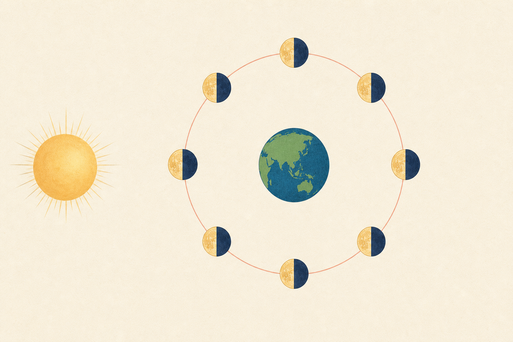

[← 地学の目次](./README.md)

# 月

## この単元でつかむこと

- 月の見える位置の変化
- 月の形が変わって見える理由
- 新月・上弦・満月・下弦の位置
- 四つの月相の出・南中時刻
- 月が毎日遅れて見える理由
- 月の自転と公転

*図は太陽・地球・8つの月の位置と日照方向を示す模式図で<ruby>縮尺<rp>（</rp><rt>しゅくしゃく</rt><rp>）</rp></ruby>は正確ではなく、地球から見た月相の説明は本文に従います。*

## カード構成

6枚（比較2・因果2・読図1・誤解対策1）

## 読み進め方

表を見て答えを思い浮かべた後、裏の第一文で核を確認し、続く説明で理由・比較・実験条件を補います。最後の「つながり」から少なくとも一語を選び、関係を一文で説明してください。

| 表 | 裏 |
|---|---|
| 月の見える位置の変化 | 同じ日の数時間では月は東から西へ動いて見える。一方、毎日同じ時刻に観察すると、月は前日より東側に見える。地球の自転と月の公転という別の運動を区別する。**関連語：**日周運動／月の公転／自転／観察時刻 |
| 月の形が変わって見える理由 | 月は自ら光らず、太陽光を反射している。月が地球の周りを公転し、太陽に照らされた半球を地球から見る角度が変わるため、満ち欠けして見える。地球の影が原因なのは月食のときだけ。**関連語：**月の公転／太陽光／満ち欠け／月食 |
| 新月・上弦・満月・下弦の位置 | 新月は月が太陽とほぼ同方向、満月は太陽と反対方向。上弦・下弦は地球から見て太陽方向と約90°。月の照らされた側は常に太陽を向く。**関連語：**新月／上弦の月／満月／下弦の月 |
| 四つの月相の出・南中時刻 | 新月は太陽とほぼ同時に昇り昼ごろ南中するが、太陽と同方向なので通常は見えない。満月は日没ごろ昇り真夜中ごろ南中、上弦は正午ごろ昇り日没ごろ南中、下弦は真夜中ごろ昇り日の出ごろ南中する。**関連語：**月の出／南中／月の入り／満ち欠け |
| 月が毎日遅れて見える理由 | 月が地球の周りを西から東へ公転し、1日に星空に対して約13°東へ移動するため、地球が余分に自転する必要がある。月の出・南中・月の入りは平均約50分ずつ遅くなる。**関連語：**月の公転／13度／50分／南中時刻 |
| 月の自転と公転 | 月は星空に対して約27.3日で地球を公転し、自転周期もほぼ同じため、地球にはほぼ同じ面を向け続ける。地球も太陽の周りを進むので、満ち欠けが同じ形へ戻る周期は約29.5日。月が自転していないなら、公転中に違う面が見えるはずである。**関連語：**同期回転／公転周期／満ち欠け／月の裏側 |
