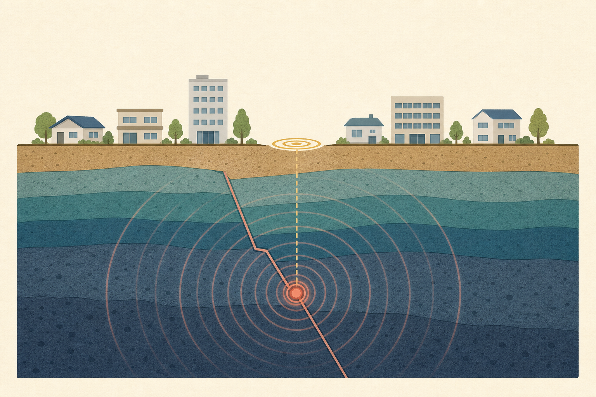

[← 地学の目次](./README.md)

# 地震

## この単元でつかむこと

- 震源と<ruby>震央<rp>（</rp><rt>しんおう</rt><rp>）</rp></ruby>
- P波とS波
- 初期微動と主要動
- 初期微動継続時間と震源距離
- 地震波の速さを求めるグラフ
- 発震時刻の求め方
- 震度
- マグニチュード
- 震度とマグニチュードの違い
- 地震が起こる仕組み
- 津波が起こる仕組み
- 複数観測点から<ruby>震央<rp>（</rp><rt>しんおう</rt><rp>）</rp></ruby>を推定する方法

*図は震源・<ruby>震央<rp>（</rp><rt>しんおう</rt><rp>）</rp></ruby>・断層の関係を示す模式図で<ruby>縮尺<rp>（</rp><rt>しゅくしゃく</rt><rp>）</rp></ruby>は正確ではなく、詳細な定義は本文に従います。*

## カード構成

13枚（比較4・用語3・計算2・読図2・因果2）

## 読み進め方

表を見て答えを思い浮かべた後、裏の第一文で核を確認し、続く説明で理由・比較・実験条件を補います。最後の「つながり」から少なくとも一語を選び、関係を一文で説明してください。

| 表 | 裏 |
|---|---|
| 震源と<ruby>震央<rp>（</rp><rt>しんおう</rt><rp>）</rp></ruby> | 地下で岩盤が破壊され地震が発生した場所が震源、その真上の地表点が震央。震央に最も近い地点が必ず最大震度になるとは限らず、地盤や震源の深さも影響する。**関連語：**震源／震央／震度／断層 |
| P波とS波 | P波は速く伝わる縦波で、固体・液体・気体を伝わり初期微動を起こす。S波は遅い横波で、固体だけを伝わり主要動を起こす。液体の外核をS波が通らないことは、地球内部を知る手がかりになる。**関連語：**初期微動／主要動／縦波／横波 |
| 初期微動と主要動 | 最初の小さな揺れが初期微動でP波による。その後の大きな揺れが主要動でS波による。初期微動継続時間はP波到着からS波到着までの時間。**関連語：**P波／S波／初期微動継続時間／地震計 |
| 初期微動継続時間と震源距離 | P波とS波の速さの差によって生じ、震源から遠いほど長くなる。同じ地震なら震源距離にほぼ比例するため、既知地点との比例計算で距離を求められる。地震の規模を直接表す時間ではない。**関連語：**P波／S波／震源距離／比例 |
| 地震波の速さを求めるグラフ | 横軸が距離、縦軸が到着時刻または経過時間なら、直線の傾きは時間差÷距離差で、速さ＝距離差÷時間差。したがって傾きが小さいP波の方が速い。絶対的な到着時刻をそのまま伝わる時間として割らず、2点の差か発震時刻を使う。**関連語：**走時曲線／P波／S波／速さ |
| 発震時刻の求め方 | P波の到着時刻から、震源距離÷P波の速さで求めた伝わる時間を引く。複数観測点の走時曲線を距離0まで延長した交点からも読める。到着時刻と発生時刻を混同しない。**関連語：**P波到着時刻／震源距離／走時曲線／発震時刻 |
| 震度 | ある地点での揺れの強さを表し、日本では気象庁震度階級0〜7（5と6は弱・強）を用いる。同じ地震でも震源距離・深さ・地盤などで地点ごとに異なる。**関連語：**気象庁震度階級／地盤／震源距離／マグニチュード |
| マグニチュード | 地震そのものの規模、すなわち放出エネルギーの大きさを表す。原則として一つの地震に一つの値。1大きくなるとエネルギーは約32倍、2大きいと約1000倍。**関連語：**震度／地震エネルギー／震源／対数 |
| 震度とマグニチュードの違い | マグニチュードは地震全体の規模、震度は各地点の揺れ。大きな地震でも遠ければ震度は小さいことがあり、小規模でも浅く近ければ強く揺れることがある。**関連語：**震度／マグニチュード／震源距離／震源の深さ |
| 地震が起こる仕組み | プレート運動などで岩盤に力がたまり、限界を超えると断層面で急にずれて弾性エネルギーが地震波として放出される。地震後もプレート運動は続く。**関連語：**プレート／断層／弾性エネルギー／地震波 |
| 海溝型地震と内陸地震 | 海溝型は沈み込むプレート境界などで起こり、規模が大きく津波を伴うことがある。内陸地震は陸側プレート内部の活断層などで起こり、浅くても局地的に強く揺れる。**関連語：**海溝／活断層／津波／プレート境界 |
| 津波が起こる仕組み | 海底が地震などで急に上下し、海水全体が押し上げ・引き下げられて長い波が広がる。深海では低く速く、浅海で速度が落ち波高が増す。通常の風波とは仕組みが違う。**関連語：**海底変動／海溝型地震／波高／避難 |
| 複数観測点から<ruby>震央<rp>（</rp><rt>しんおう</rt><rp>）</rp></ruby>を推定する方法 | 地図上で各観測点を中心に、求めた震央距離を半径とする円を描くと、共通の交点付近が震央になる。2地点では候補が2つ残り得るため、3地点以上で絞る。震源距離しかない場合は本来、観測点を中心とする球面の地下での交点が震源で、その真上が震央である。**関連語：**震央／震源距離／初期微動継続時間／走時曲線 |
