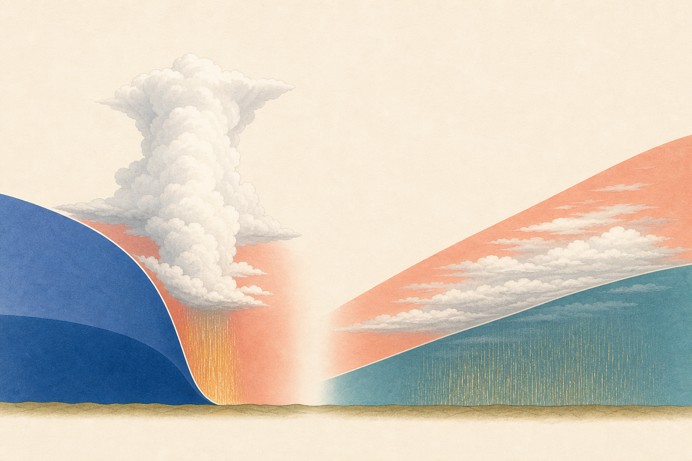

[← 地学の目次](./README.md)

# 前線

## この単元でつかむこと

- 温暖前線
- 寒冷前線
- 温暖前線と寒冷前線の断面
- 停滞前線

*図は寒冷前線と温暖前線の断面を比べる模式図で<ruby>縮尺<rp>（</rp><rt>しゅくしゃく</rt><rp>）</rp></ruby>は正確ではなく、雲と降水の詳しい対応は本文に従います。*

## カード構成

6枚（用語4・比較1・読図1）

## 読み進め方

表を見て答えを思い浮かべた後、裏の第一文で核を確認し、続く説明で理由・比較・実験条件を補います。最後の「つながり」から少なくとも一語を選び、関係を一文で説明してください。

| 表 | 裏 |
|---|---|
| 温暖前線 | 暖気が寒気の上を緩やかにはい上がる前線。広い範囲に層状の雲ができ、比較的弱い雨が長く続きやすい。通過後は気温が上がり、風向が変化することが多い。**関連語：**暖気／寒気／乱層雲／気温上昇 |
| 寒冷前線 | 進む寒気が暖気の下にもぐり込み、暖気を急に押し上げる前線。積乱雲が発達し、狭い範囲で短時間の強い雨や雷・突風が起こりやすい。通過後は気温が下がる。**関連語：**積乱雲／強雨／寒気／気温低下 |
| 温暖前線と寒冷前線の断面 | 温暖前線は傾斜が緩く雲・雨域が前線の前方へ広がる。寒冷前線は傾斜が急で、前線付近に積乱雲が並びやすい。暖気はどちらでも密度の大きい寒気の上に上がる。**関連語：**前線面／暖気／寒気／雲の種類 |
| 停滞前線 | 暖気と寒気の勢力がほぼ同じで、境界があまり移動しない前線。長期間にわたり曇りや雨をもたらす。日本の梅雨前線や秋雨前線が代表。**関連語：**梅雨前線／秋雨前線／気団／長雨 |
| <ruby>閉塞前線<rp>（</rp><rt>へいそくぜんせん</rt><rp>）</rp></ruby> | 寒冷前線が温暖前線に追いつき、地上の暖気が押し上げられた前線。発達した温帯低気圧の後期に見られる。天気図では三角と半円が同じ側に交互に並ぶ。**関連語：**温帯低気圧／寒冷前線／温暖前線／前線記号 |
| 4種類の前線記号と進行方向 | 前線／記号／進行方向／ 温暖／半円／半円が向く側／ 寒冷／三角／三角が向く側／ 停滞／半円と三角が反対側／動きが小さく、一方向を示さない／ 閉塞／半円と三角が同じ側／記号が向く側／ 白黒図では色でなく形と記号の側を読む。**関連語：**温暖前線／寒冷前線／停滞前線／<ruby>閉塞前線<rp>（</rp><rt>へいそくぜんせん</rt><rp>）</rp></ruby> |
