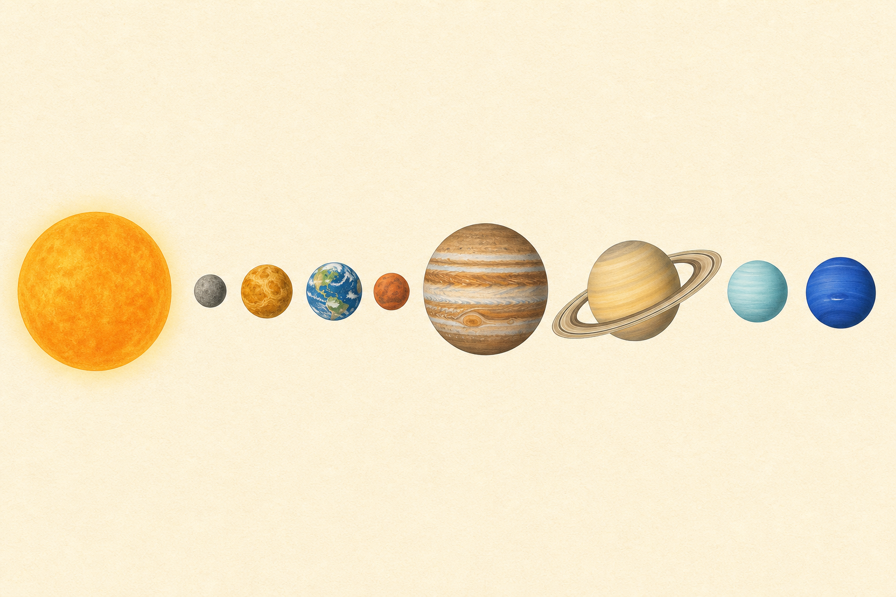

[← 地学の目次](./README.md)

# 太陽系

## この単元でつかむこと

- 太陽系の惑星の順序
- 地球型惑星と木星型惑星
- <ruby>恒星<rp>（</rp><rt>こうせい</rt><rp>）</rp></ruby>・惑星・衛星

*図は8惑星の順序と特徴を示す概念図で大きさ・距離の<ruby>縮尺<rp>（</rp><rt>しゅくしゃく</rt><rp>）</rp></ruby>は正確ではなく、分類と順序は本文に従います。*

## カード構成

4枚（用語1・比較3）

## 読み進め方

表を見て答えを思い浮かべた後、裏の第一文で核を確認し、続く説明で理由・比較・実験条件を補います。最後の「つながり」から少なくとも一語を選び、関係を一文で説明してください。

| 表 | 裏 |
|---|---|
| 太陽系の惑星の順序 | 太陽に近い順に水星・金星・地球・火星・木星・土星・天王星・海王星。惑星は太陽の周りをほぼ同一平面上で同じ向きに公転する。冥王星は準惑星。**関連語：**水星／地球型惑星／木星型惑星／準惑星 |
| 地球型惑星と木星型惑星 | 地球型は水星・金星・地球・火星で、小さく高密度の岩石質。木星型は木星・土星・天王星・海王星で、大きく低密度、厚い大気と多くの衛星・環をもつ。**関連語：**岩石質／密度／衛星／環 |
| <ruby>恒星<rp>（</rp><rt>こうせい</rt><rp>）</rp></ruby>・惑星・衛星 | 恒星は自ら光を放つ天体、惑星は恒星の周りを回り主に反射光で見える天体、衛星は惑星などの周りを回る天体。太陽は恒星、地球は惑星、月は衛星。**関連語：**恒星／惑星／衛星／太陽 |
| 小惑星・<ruby>彗星<rp>（</rp><rt>すいせい</rt><rp>）</rp></ruby>・流星 | 小惑星は主に火星と木星の間などを公転する小天体。彗星は氷やちりを含み、太陽に近づくと尾を生じ、尾は太陽と反対向き。流星は小粒子が大気中で発光する現象。**関連語：**小惑星帯／彗星／流星体／太陽風 |
