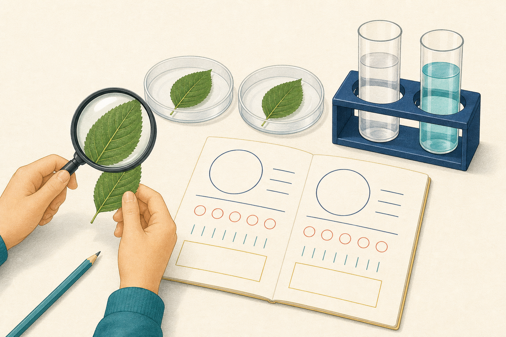

[← 探究の目次](./README.md)

# 科学的探究

## この単元でつかむこと

- だれが見ても検討できる記録
- 仮説を支持する証拠の条件
- 予想と違う結果が出たときの順序
- 実験結果から言える範囲
- 操作の理由まで説明する実験計画
- 観察した事実と考えたことの区別
- 科学で調べやすい問いの条件
- 予想と仮説の違い
- 根拠のある予想
- 一つの条件だけを変える理由
- 実験で意図的に変える量
- 実験で同じに保つ量
- 実験で結果として測る量
- 対照実験
- 公平な実験になっているかの確認

*観察・条件制御・記録の関係を示す概念図で、試料や器具は<ruby>縮尺<rp>（</rp><rt>しゅくしゃく</rt><rp>）</rp></ruby>どおりではなく、実験条件の解釈は本文を優先してください。*

## カード構成

18枚（用語9・因果3・実験3・誤解対策1・比較2）

## 読み進め方

表を見て答えを思い浮かべた後、裏の第一文で核を確認し、続く説明で理由・比較・実験条件を補います。最後の「つながり」から少なくとも一語を選び、関係を一文で説明してください。

| 表 | 裏 |
|---|---|
| 同じ方法で結果を確かめ直せる性質 | 条件・手順をそろえて繰り返したとき、同様の結果が得られる性質を、中学理科では広く再現性として扱う。厳密には、同じ人・器具・場所など同一条件での一致は反復性と呼び、条件を変えて確かめる再現性と区別することがある。**関連語：**再現性／反復性／実験手順／記録 |
| 別の人や方法でも確かめる意味 | 人・場所・装置が変わっても似た結論になるか調べると、特定の操作癖や装置だけによる結果を見抜ける。これは結果の客観性と信頼性を高める。**関連語：**追試／客観性／再現性／信頼性 |
| だれが見ても検討できる記録 | 測定値、条件、手順、判断基準を公開し、個人の印象だけに頼らない記録である。同じ証拠を他者が点検できることが客観性を支える。**関連語：**客観性／測定値／記録／証拠 |
| 仮説を支持する証拠の条件 | 仮説から予想される結果と一致し、別の説明や偶然では説明しにくいデータである。一致する一例だけで「完全に証明」とせず、反対の結果も探す。**関連語：**仮説／証拠／別解釈／<ruby>反証<rp>（</rp><rt>はんしょう</rt><rp>）</rp></ruby> |
| <ruby>反証<rp>（</rp><rt>はんしょう</rt><rp>）</rp></ruby>できる仮説 | どの観察結果が出れば誤りだと判断するかを、実験前に示せる仮説である。どんな結果にも後付けで合わせられる説明は、科学的に厳しく検討できない。**関連語：**反証可能性／仮説／予測／検証 |
| 予想と違う結果が出たときの順序 | まず記録・操作・器具・条件を確認し、必要なら再実験する。結果を都合よく変えず、再現するなら仮説や前提を修正する。**関連語：**予想外の結果／再実験／仮説修正／誤差 |
| 実験結果から言える範囲 | 実際に調べた対象・条件・数値範囲に限って結論を書く。少数の植物や一つの温度で得た結果を、全生物・全条件へ無条件に広げない。**関連語：**結論／一般化／標本／<ruby>外挿<rp>（</rp><rt>がいそう</rt><rp>）</rp></ruby> |
| 操作の理由まで説明する実験計画 | 手順だけでなく「温度をそろえて別要因を除く」「最初の気体を捨てて装置内の空気を除く」のように目的を書く。理由があると、必要な操作と不要な操作を判別できる。**関連語：**実験計画／操作理由／条件制御／安全 |
| 観察した事実と考えたことの区別 | 「液が青になった」は観察事実、「アルカリ性だ」は知識を使った解釈である。記録で両者を分けると、同じ証拠から解釈が妥当か確かめられる。**関連語：**観察事実／解釈／証拠／結論 |
| 科学で調べやすい問いの条件 | 対象と比べる量が明確で、観察・測定・実験・資料によって確かめられる問いである。好みや価値だけを尋ねる問いは、科学データだけでは決められない。**関連語：**問い／測定可能性／証拠／価値判断 |
| 予想と仮説の違い | 予想は結果の見通し、仮説は結果がそうなる仕組みまで含む、確かめ可能な説明である。「温度が上がると思う」に「日光で地面が温められるから」を加えると仮説に近づく。**関連語：**予想／仮説／根拠／検証 |
| 根拠のある予想 | 生活経験、既習の法則、事前観察など、予想を支える事実を示した予想である。単なる当てずっぽうと区別し、結果が違えば根拠や考えを見直す。**関連語：**予想／根拠／既習事項／考察 |
| 一つの条件だけを変える理由 | 結果の違いを、変えた条件の影響として説明しやすくするためである。二つ以上を同時に変えると、どちらが原因か切り分けられない。**関連語：**変える条件／そろえる条件／公平な実験／因果 |
| 実験で意図的に変える量 | 原因として働くか調べるため、実験者が段階的に変える量を独立変数という。横軸に置くことが多いが、時間のように自然に進む量も独立変数として扱う場合がある。**関連語：**独立変数／横軸／条件制御／従属変数 |
| 実験で同じに保つ量 | 調べたい条件以外で結果へ影響しそうな量を統制変数といい、各組で同じにする。振り子の長さの影響なら、おもりの重さや振れ幅をそろえる。**関連語：**統制変数／公平な実験／振り子／独立変数 |
| 実験で結果として測る量 | 変えた条件に応じて変化するかを測る量を従属変数という。通常は縦軸に置き、単位と測定方法を実験前に決める。**関連語：**従属変数／縦軸／測定／独立変数 |
| 対照実験 | 調べる処理をしない、または標準条件にした組を対照とし、処理した組との違いを比べる実験。結果の差が、調べたい処理の効果かどうかを判断しやすくする。**関連語：**対照／比較／条件制御／発芽 |
| 公平な実験になっているかの確認 | 変えた条件が一つか、他の条件がそろうか、同じ方法で測るか、十分に繰り返すかを確認する。装置の見た目が同じだけでは公平とは限らない。**関連語：**条件制御／測定方法／反復／対照 |
