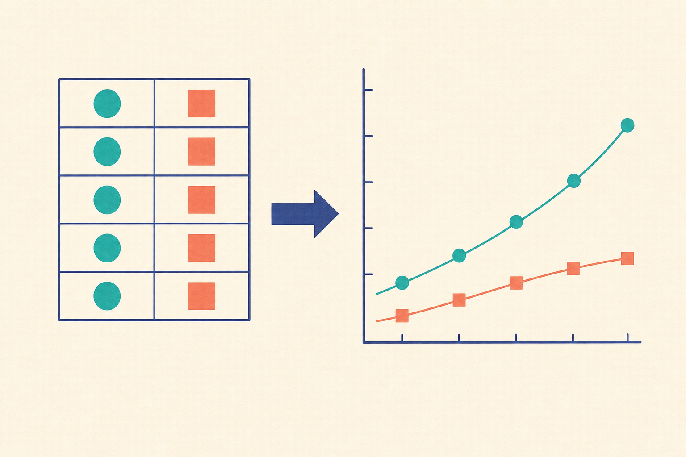

[← 探究の目次](./README.md)

# 表とグラフ

## この単元でつかむこと

- 原点を省いたグラフの注意
- 測定点を順番に結ばない場合
- 原点を通る直線が示す関係
- グラフの水平部分の読み方
- 二つの量の関係を見る点の集まり
- グラフの傾きが表すもの
- 複数の曲線を比べる順序
- 傾向から外れた点の扱い
- 測定範囲の外を予測すること
- 表の見出しに書く二つの情報
- 横軸に置く量の決め方
- 縦軸に置く量の決め方
- データに合う目盛の取り方
- 分類名の間を線で結べない理由

*測定値を表からグラフへ表し替える概念図で、点や目盛は実データの<ruby>縮尺<rp>（</rp><rt>しゅくしゃく</rt><rp>）</rp></ruby>ではなく、軸と傾向の解釈は本文を優先してください。*

## カード構成

16枚（誤解対策2・読図8・計算1・用語3・実験1・因果1）

## 読み進め方

表を見て答えを思い浮かべた後、裏の第一文で核を確認し、続く説明で理由・比較・実験条件を補います。最後の「つながり」から少なくとも一語を選び、関係を一文で説明してください。

| 表 | 裏 |
|---|---|
| 原点を省いたグラフの注意 | 変化を拡大して見やすくできる一方、差が実際より大きく見えることがある。軸の開始値と途中の省略記号を確認し、棒の高さだけで差の割合を判断しない。**関連語：**原点／軸の省略／見かけの差／資料読解 |
| 測定点を順番に結ばない場合 | 連続した関係を調べ、測定誤差で点が散らばるときは、全体の傾向を表す直線や曲線を引く。各点を折れ線で結ぶと、測っていない細かな上下まで事実のように見える。**関連語：**近似線／測定誤差／傾向／散布図 |
| 原点を通る直線が示す関係 | 一方が2倍、3倍になると他方も2倍、3倍になる比例関係を示す。直線でも原点を通らなければ、単純な比例とはいえない。**関連語：**比例／原点／直線／比例定数 |
| グラフの水平部分の読み方 | 横軸が進んでも縦軸の量が変わらないことを示す。ただし「何も起きていない」とは限らず、沸騰中のように温度一定でも状態変化が進む場合がある。**関連語：**水平部分／変化なし／状態変化／加熱曲線 |
| 二つの量の関係を見る点の集まり | 各測定を一つの点として表す散布図を使うと、増減の傾向、ばらつき、外れ値が見える。点が右上がりでも、それだけで因果関係は証明できない。**関連語：**散布図／相関／外れ値／因果 |
| グラフの傾きが表すもの | 傾きは縦軸の変化量÷横軸の変化量で、横へ1単位進むと縦がどれだけ変わるかを表す。意味と単位は軸によって変わり、距離―時間なら速さになる。**関連語：**傾き／変化量／速さ／単位 |
| 複数の曲線を比べる順序 | <ruby>凡例<rp>（</rp><rt>はんれい</rt><rp>）</rp></ruby>を確認し、同じ横軸の値で縦軸を比べ、交点・傾き・最大最小・変化開始時点を見る。一方だけ別の時刻で比べない。**関連語：**凡例／複数系列／傾き／交点 |
| 測定点の間の値を見積もること | 既知データの範囲内で、点と点の間の値を傾向から見積もることを<ruby>内挿<rp>（</rp><rt>ないそう</rt><rp>）</rp></ruby>という。関係が滑らかに続くという仮定を使うため、急変点がある場合は注意する。**関連語：**内挿／近似線／測定範囲／推定 |
| 傾向から外れた点の扱い | すぐ削除せず、記録・器具・条件を確認し、可能なら再測定する。ミスと確認できれば理由付きで除外し、再現するなら新しい現象の手掛かりとして残す。**関連語：**外れ値／再測定／操作ミス／発見 |
| 測定範囲の外を予測すること | 既知データの外側へ傾向を延ばして見積もることを<ruby>外挿<rp>（</rp><rt>がいそう</rt><rp>）</rp></ruby>という。範囲外では法則や状態が変わる可能性があり、<ruby>内挿<rp>（</rp><rt>ないそう</rt><rp>）</rp></ruby>より不確かさが大きい。**関連語：**外挿／内挿／不確かさ／適用範囲 |
| 表の見出しに書く二つの情報 | 何を測った列かを示す量名と、その値の単位を書く。例は「時間（s）」であり、数値欄へ単位を毎回書かなくても意味が一意になる。**関連語：**表／量名／単位／測定値 |
| 横軸に置く量の決め方 | 実験者が変えた量や、時間のように変化の基準となる量を横軸に置く。軸名と単位を添え、条件の順序が意味をもつよう並べる。**関連語：**横軸／独立変数／時間／グラフ |
| 縦軸に置く量の決め方 | 横軸の条件に応じて測った結果を縦軸に置く。軸名・単位・測定範囲を明示すると、何の変化か読み取れる。**関連語：**縦軸／従属変数／測定結果／グラフ |
| データに合う目盛の取り方 | 最大値・最小値と用紙の大きさを見て、同じ間隔が同じ量を表す目盛にする。2、5、10の倍数など読みやすい刻みを選び、点が狭い範囲へ固まらないようにする。**関連語：**目盛／軸／測定範囲／作図 |
| 測定点を正確に打つ手順 | 横軸の条件から縦へ、縦軸の測定値から横へたどり、交点へ小さく明確な点を打つ。点の中心が値を表し、大きな丸で位置を曖昧にしない。**関連語：**座標／測定点／横軸／縦軸 |
| 分類名の間を線で結べない理由 | 「昆虫・魚・鳥」のような分類名の間には、時間や温度のような連続した途中の値がない。各分類の量は独立した棒などで比べ、存在しない中間値を線で表さない。**関連語：**離散データ／棒グラフ／分類／連続量 |
