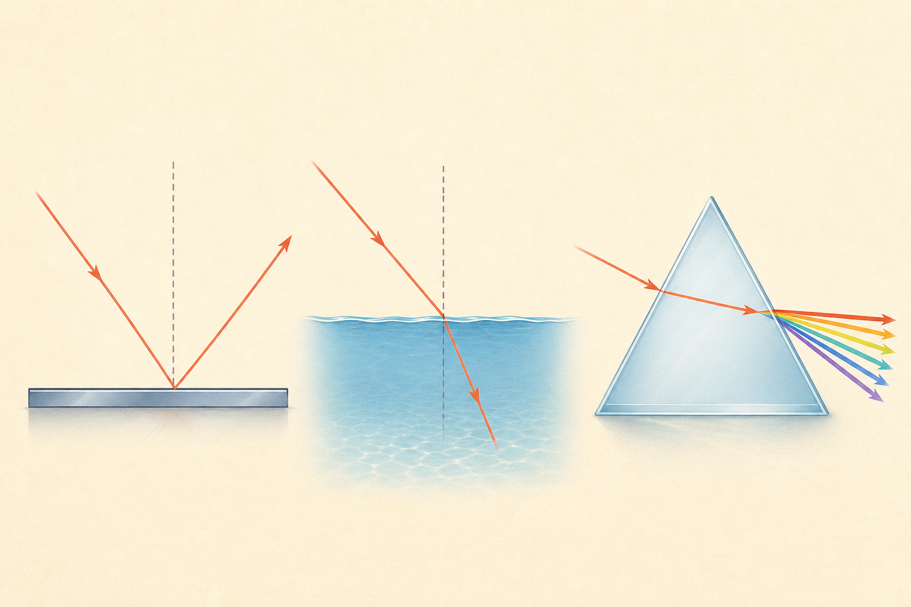

[← 物理の目次](./README.md)

# 光

## この単元でつかむこと

- 光の直進
- 鏡で反射する日光
- 日光を集めたときの明るさと暖かさ
- 光の反射
- 入射角と反射角
- 平面鏡の像
- <ruby>屈折<rp>（</rp><rt>くっせつ</rt><rp>）</rp></ruby>
- 屈折角
- <ruby>凸レンズ<rp>（</rp><rt>とつれんず</rt><rp>）</rp></ruby>
- 焦点と焦点距離
- 実像
- <ruby>虚像<rp>（</rp><rt>きょぞう</rt><rp>）</rp></ruby>
- 物体が焦点の内側
- <ruby>凸レンズ<rp>（</rp><rt>とつれんず</rt><rp>）</rp></ruby>の作図

*光の進み方を示す概念的な模式図で<ruby>縮尺<rp>（</rp><rt>しゅくしゃく</rt><rp>）</rp></ruby>と角度は厳密ではないため、反射・<ruby>屈折<rp>（</rp><rt>くっせつ</rt><rp>）</rp></ruby>の条件は本文を正とします。*

## カード構成

22枚（用語8・因果4・計算1・誤解対策1・比較2・読図4・実験2）

## 読み進め方

表を見て答えを思い浮かべた後、裏の第一文で核を確認し、続く説明で理由・比較・実験条件を補います。最後の「つながり」から少なくとも一語を選び、関係を一文で説明してください。

| 表 | 裏 |
|---|---|
| 光の直進 | 光は同じ物質の中ではまっすぐ進む。小さな穴を通した光の筋や、影ができることから確かめられる。光線は光の進む道筋を矢印付きの線で表したもの。**関連語：**影／光線／反射 |
| 影のでき方 | 光源からの光が不透明な物体にさえぎられた場所に影ができる。光源に物体を近づけるほど影は大きくなりやすい。半透明な物体は一部の光を通す。**関連語：**光の直進／光源／透明・不透明 |
| 鏡で反射する日光 | 鏡に当たった日光は向きを変えて進み、鏡の向きを変えると反射した光が届く場所も変わる。日光は直進するので、鏡の向きと明るい部分の位置を対応させて調べる。**関連語：**鏡／反射／日光／光の直進 |
| 日光を集めたときの明るさと暖かさ | 鏡で反射した日光を重ねたり虫眼鏡で集めたりすると、光が集まった所は明るくなり、温度も上がる。太陽や強い光を直接見ず、人・生物・燃えやすい物へ光を集めない。**関連語：**集光／明るさ／温度／観察安全 |
| 光の反射 | 光が物体の表面ではね返る現象。入射光、反射光、法線は同一平面上にあり、入射角＝反射角となる。角度は鏡の面ではなく法線から測る。**関連語：**入射角／反射角／法線 |
| 入射角と反射角 | 入射角は入射光と法線のなす角、反射角は反射光と法線のなす角。反射の法則により常に等しい。鏡面との角度が示されたら90°から引く。**関連語：**反射の法則／法線／平面鏡 |
| 平面鏡の像 | 像は鏡の奥に、物体と鏡の距離と同じだけ離れて見え、大きさも同じ。光が実際に鏡の奥から来るのではなく、反射光を後方へ延長した交点に見える<ruby>虚像<rp>（</rp><rt>きょぞう</rt><rp>）</rp></ruby>である。**関連語：**虚像／反射／対称 |
| 鏡で全身を見る条件 | 平面鏡で全身を見るのに必要な鏡の縦の長さは、目の位置によらず身長の1/2。頭頂と足先から目へ届く反射光を作図すると分かり、鏡から離れても必要な長さは変わらない。**関連語：**平面鏡／反射の作図／相似 |
| <ruby>屈折<rp>（</rp><rt>くっせつ</rt><rp>）</rp></ruby> | 光が異なる物質の境界を斜めに通ると、速さが変わって進む向きも変わる現象。空気から水・ガラスへ入ると法線側へ、水・ガラスから空気へ出ると法線から離れる。**関連語：**法線／全反射／<ruby>凸レンズ<rp>（</rp><rt>とつれんず</rt><rp>）</rp></ruby> |
| 屈折角 | <ruby>屈折<rp>（</rp><rt>くっせつ</rt><rp>）</rp></ruby>した光と法線のなす角。空気から水へ進むと屈折角は入射角より小さく、水から空気へ進むと大きい。垂直に入射すると向きは変わらない。**関連語：**入射角／法線／屈折 |
| 水中の物体が浅く見える理由 | 水中の物体から出た光が水面で法線から離れる向きに<ruby>屈折<rp>（</rp><rt>くっせつ</rt><rp>）</rp></ruby>し、目は光が直進してきたと判断するため、光線を逆向きに延長した位置に物体があるように見える。**関連語：**屈折／<ruby>虚像<rp>（</rp><rt>きょぞう</rt><rp>）</rp></ruby>／光の直進 |
| 全反射 | 水やガラスなど光が遅い物質から空気側へ進むとき、入射角が一定以上になると境界を通り抜けず、すべて反射する現象。空気側から水側へでは起こらない。**関連語：**<ruby>屈折<rp>（</rp><rt>くっせつ</rt><rp>）</rp></ruby>／臨界角／光ファイバー |
| <ruby>凸レンズ<rp>（</rp><rt>とつれんず</rt><rp>）</rp></ruby> | 中央が厚く、平行な光を集めるレンズ。光軸に平行な光は屈折後に焦点を通り、レンズの中心を通る光はほぼ直進する。この2本を使って像を作図する。**関連語：**焦点／実像／<ruby>屈折<rp>（</rp><rt>くっせつ</rt><rp>）</rp></ruby> |
| 焦点と焦点距離 | 光軸に平行な光が<ruby>凸レンズ<rp>（</rp><rt>とつれんず</rt><rp>）</rp></ruby>で<ruby>屈折<rp>（</rp><rt>くっせつ</rt><rp>）</rp></ruby>して集まる点が焦点。レンズの中心から焦点までが焦点距離で、同じレンズなら基本的に一定。レンズの両側に焦点がある。**関連語：**凸レンズ／光軸／実像 |
| 実像 | 光が実際に集まってでき、スクリーンに映せる像。<ruby>凸レンズ<rp>（</rp><rt>とつれんず</rt><rp>）</rp></ruby>で物体を焦点の外側に置くとでき、上下左右が逆の倒立像になる。物体を焦点へ近づけるほど像は遠く、大きくなる。**関連語：**凸レンズ／<ruby>虚像<rp>（</rp><rt>きょぞう</rt><rp>）</rp></ruby>／スクリーン |
| <ruby>虚像<rp>（</rp><rt>きょぞう</rt><rp>）</rp></ruby> | 光が実際には集まらず、光線を逆向きに延長した位置に見える像。スクリーンには映らない。<ruby>凸レンズ<rp>（</rp><rt>とつれんず</rt><rp>）</rp></ruby>では物体を焦点の内側に置くと、正立で拡大した虚像になる。**関連語：**実像／焦点／虫眼鏡 |
| 物体が焦点の2倍より外側 | <ruby>凸レンズ<rp>（</rp><rt>とつれんず</rt><rp>）</rp></ruby>から物体までの距離が焦点距離の2倍より大きいと、反対側の焦点の1〜2倍の位置に、倒立で縮小した実像ができる。**関連語：**凸レンズ／実像／焦点距離 |
| 物体が焦点距離の2倍の位置 | 物体を<ruby>凸レンズ<rp>（</rp><rt>とつれんず</rt><rp>）</rp></ruby>の2Fに置くと、反対側の2Fに、物体と同じ大きさの倒立実像ができる。像と物体はレンズをはさんで対称な距離になる。**関連語：**2F／倒立像／焦点 |
| 物体が焦点と2倍焦点の間 | <ruby>凸レンズ<rp>（</rp><rt>とつれんず</rt><rp>）</rp></ruby>のFと2Fの間に物体を置くと、反対側の2Fより遠くに、倒立で拡大した実像ができる。物体をFへ近づけるほど像は遠ざかり拡大する。**関連語：**凸レンズ／拡大像／実像 |
| 物体が焦点の内側 | 物体を<ruby>凸レンズ<rp>（</rp><rt>とつれんず</rt><rp>）</rp></ruby>と焦点の間に置くと、物体と同じ側に正立で拡大した<ruby>虚像<rp>（</rp><rt>きょぞう</rt><rp>）</rp></ruby>が見える。光は実際には集まらないのでスクリーンには映らない。**関連語：**虫眼鏡／虚像／焦点 |
| <ruby>凸レンズ<rp>（</rp><rt>とつれんず</rt><rp>）</rp></ruby>の作図 | 物体の先端から①光軸に平行→屈折後に反対側の焦点、②レンズ中心→直進、の2本を引く。交点が実像の先端。<ruby>虚像<rp>（</rp><rt>きょぞう</rt><rp>）</rp></ruby>では屈折光を物体側へ延長する。**関連語：**焦点／実像／虚像 |
| スクリーンに像が映らないとき | 物体が焦点の内側、スクリーン位置が像の位置と不一致、またはレンズ・物体・スクリーンの中心が一直線でない可能性がある。<ruby>虚像<rp>（</rp><rt>きょぞう</rt><rp>）</rp></ruby>はスクリーンを動かしても映らない。**関連語：**実像／虚像／焦点 |
