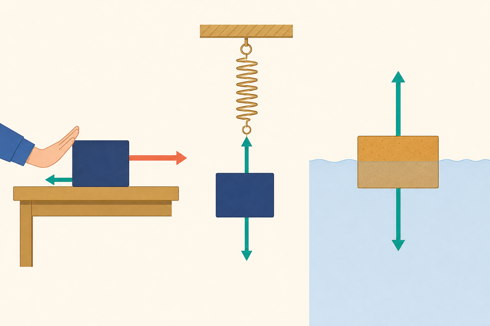

[← 物理の目次](./README.md)

# 力

## この単元でつかむこと

- てこの三点
- てこのつり合い
- 小さい力でてこを動かす方法
- 力の三つのはたらき
- 力の三要素
- 重力
- 弾性力
- 摩擦力
- 力のつり合い
- 力の単位ニュートン
- 質量と重さ
- ばねばかり
- フックの法則
- ばねの伸びの計算
- 合力
- 動滑車
- 斜面と仕事

*力の向きとつり合いを示す概念的な模式図で<ruby>縮尺<rp>（</rp><rt>しゅくしゃく</rt><rp>）</rp></ruby>と矢印の長さは厳密ではないため、力の関係は本文を正とします。*

## カード構成

22枚（用語8・計算5・因果2・誤解対策2・比較2・実験1・読図2）

## 読み進め方

表を見て答えを思い浮かべた後、裏の第一文で核を確認し、続く説明で理由・比較・実験条件を補います。最後の「つながり」から少なくとも一語を選び、関係を一文で説明してください。

| 表 | 裏 |
|---|---|
| てこの三点 | てこを支える点が支点、力を加える点が力点、動かす物体から力を受ける点が作用点。支点から各点までの垂直距離が重要で、棒に沿った単純な距離とは限らない。**関連語：**支点／力点／作用点 |
| てこのつり合い | 左右の回そうとするはたらきが等しいとつり合う。力×支点からの距離が左右で等しくなる。距離は支点から力の向きへ下ろした垂線の長さで考える。**関連語：**モーメント／支点／仕事 |
| 小さい力でてこを動かす方法 | 支点から力点までを長くする、または支点から作用点までを短くする。必要な力は小さくなるが、力点を動かす距離は大きくなり、仕事の総量は理想的には変わらない。**関連語：**てこ／仕事の原理／力点 |
| 力の三つのはたらき | 力には①物体の形を変える、②速さを変える、③運動の向きを変える、というはたらきがある。物体を支えて静止させる場合も、力ははたらいている。**関連語：**変形／運動／つり合い |
| 力の三要素 | 力は大きさ・向き・作用点の三要素で表す。図では作用点から力の向きへ矢印を引き、長さで大きさを表す。矢印の尺度をそろえる。**関連語：**力の矢印／作用点／合力 |
| 重力 | 地球が物体を地球の中心方向へ引く力。物体の重心に、鉛直下向きにはたらくと考える。質量100 gの物体には地表付近で約1 Nの重力がはたらく。**関連語：**重さ／質量／重心 |
| 弾性力 | 変形した物体が元の形に戻ろうとして及ぼす力。ばねを伸ばせば縮む向き、縮めれば伸びる向きにはたらく。一定範囲では変形量と力が比例する。**関連語：**フックの法則／ばね／復元力 |
| 摩擦力 | 接触面で物体の相対的な動き、または動こうとする向きを妨げる力。必ず「進行方向と逆」とは限らず、歩くとき地面から足には前向きの摩擦力がはたらく。**関連語：**接触力／運動／仕事 |
| 垂直抗力 | 物体が面を押すとき、面から物体へ垂直に受ける力。水平面上で鉛直方向に他の力がなければ重力とつり合うが、斜面や外力があると大きさは重力と同じとは限らない。**関連語：**作用反作用／重力／摩擦力 |
| 力のつり合い | 1つの物体にはたらく2力がつり合う条件は、同一直線上にあり、大きさが等しく、向きが反対。物体は静止または等速直線運動を続ける。**関連語：**合力／<ruby>慣性<rp>（</rp><rt>かんせい</rt><rp>）</rp></ruby>／作用反作用 |
| 重心 | 物体全体の重さが集中してはたらくと考えられる点。重心から下ろした鉛直線が支持面の内側にあれば倒れにくい。重心が低く、支持面が広いほど安定する。**関連語：**重力／安定性／支持面 |
| 力の単位ニュートン | 力の単位はN（ニュートン）。地表付近では質量100 gの物体にはたらく重力を約1 Nとするため、1 kgなら約10 N。質量の単位g・kgと混同しない。**関連語：**重力／質量／ばねばかり |
| 質量と重さ | 質量は物体そのものの量で場所によらず一定、単位はg・kg。重さは重力の大きさで場所により変わり、単位はN。月面では質量は同じだが重さは地球上の約1/6。**関連語：**重力／ニュートン／月 |
| ばねばかり | ばねの伸びを利用して力の大きさをNで測る器具。使う前に0点を合わせ、最大目盛りを超えないようにし、力の向きとばねの向きをそろえて読む。**関連語：**弾性力／フックの法則／ニュートン |
| フックの法則 | ばねの弾性の限界内では、ばねの伸びは加えた力に比例する。グラフは原点を通る直線。ばね全体の長さではなく、自然長から増えた「伸び」を使う。**関連語：**弾性力／比例／ばね定数 |
| ばねの伸びの計算 | あるばねが2 Nで3 cm伸びるなら、比例範囲で4 Nでは6 cm伸びる。全長を問われたら自然長＋伸び。複数のおもりでは合計質量をNへ直す。**関連語：**フックの法則／比例／重力 |
| 合力 | 複数の力と同じはたらきをする1つの力。同じ向きなら足し、反対向きなら大きい方から小さい方を引く。合力が0なら力はつり合う。**関連語：**力の合成／つり合い／分力 |
| 平行四辺形による力の合成 | 同じ作用点の2力を隣り合う辺とする平行四辺形を作り、作用点から引いた対角線が合力。直角な2力なら、合力の大きさは三平方の関係で求められる場合がある。**関連語：**合力／ベクトル／分力 |
| 分力 | 1つの力を、同じはたらきをする複数の方向の力に分けたもの。元の力を対角線とする平行四辺形の辺が分力。斜面上の重力を斜面方向と垂直方向へ分けるなどに使う。**関連語：**力の分解／合力／斜面 |
| 定滑車 | 軸が固定された滑車。力を加える向きを変えられるが、摩擦を無視すると必要な力の大きさも引く距離も変わらない。天井側を支点と混同しない。**関連語：**動滑車／仕事の原理／張力 |
| 動滑車 | 滑車自体が荷物とともに動く。1個を2本のロープで支える理想条件では必要な力は重さの1/2になるが、引く距離は荷物の上昇距離の2倍。滑車の重さを含む問題に注意。**関連語：**定滑車／仕事の原理／張力 |
| 斜面と仕事 | 摩擦を無視すると、斜面を使えば物体を持ち上げる力は小さくなるが、移動距離は長くなる。斜面に沿ってした仕事は、鉛直に持ち上げた仕事と等しい。**関連語：**仕事の原理／位置エネルギー／分力 |
