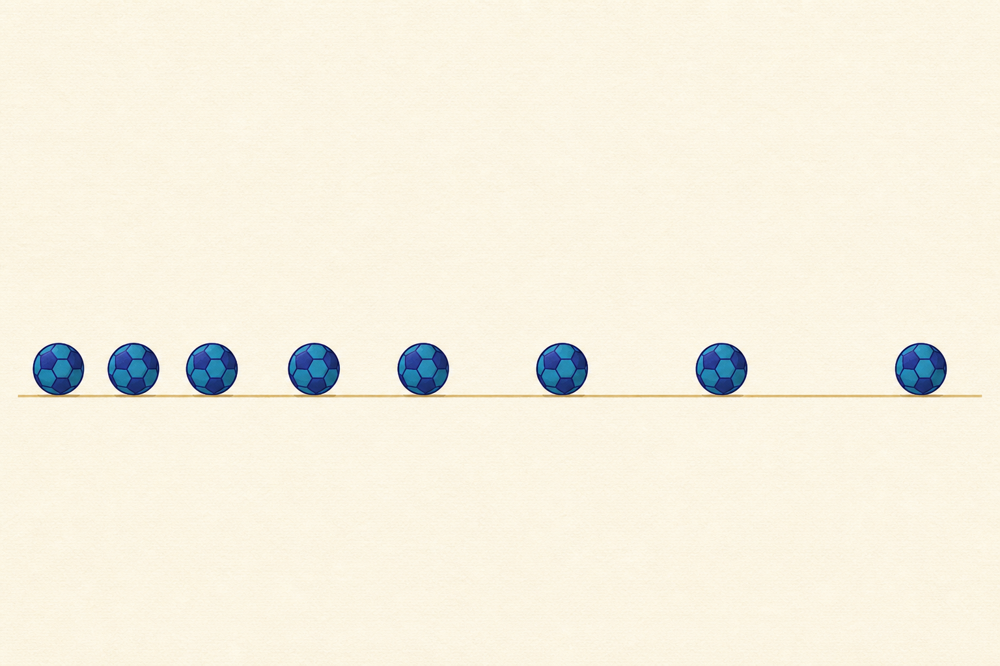

[← 物理の目次](./README.md)

# 運動

## この単元でつかむこと

- 速さ
- m/sとkm/hの変換
- 平均の速さ
- 記録タイマー
- 記録テープの読み方
- 移動距離―時間グラフ
- 速さ―時間グラフ
- 等速直線運動
- 自由落下
- 斜面を下る運動
- <ruby>慣性<rp>（</rp><rt>かんせい</rt><rp>）</rp></ruby>
- 作用・反作用
- 力と速さの変化

*一定時間ごとの位置を示す概念的な模式図で<ruby>縮尺<rp>（</rp><rt>しゅくしゃく</rt><rp>）</rp></ruby>は正確ではないため、速さと間隔の関係は本文を正とします。*

## カード構成

16枚（誤解対策4・計算3・用語3・実験1・読図3・因果2）

## 読み進め方

表を見て答えを思い浮かべた後、裏の第一文で核を確認し、続く説明で理由・比較・実験条件を補います。最後の「つながり」から少なくとも一語を選び、関係を一文で説明してください。

| 表 | 裏 |
|---|---|
| 運動の基準点 | 物体が動いているかどうかは、どの物体を基準にするかで変わる。電車内で座る人は車内には静止、地面には運動している。位置は基準点からの向きと距離で表す。**関連語：**相対運動／位置／速度 |
| 速さ | 単位時間あたりに進む距離。速さ＝距離÷時間、距離＝速さ×時間、時間＝距離÷速さ。向きを含む速度とは異なるが、中学では速さを中心に扱う。**関連語：**距離／時間／平均の速さ |
| m/sとkm/hの変換 | 1 m/s＝3.6 km/h。m/sからkm/hへは×3.6、km/hからm/sへは÷3.6。距離と時間の単位を式へ入れる前にそろえる。**関連語：**速さ／単位換算／距離 |
| 平均の速さ | 移動した全距離÷かかった全時間。区間ごとの速さを単純平均してよいのは各区間の時間が等しい場合などに限る。停止時間を含むなら全時間に含める。**関連語：**速さ／全距離／瞬間の速さ |
| 瞬間の速さ | ごく短い時間で見た速さ。自動車の速度計が示す値に相当する。記録タイマーでは短い時間間隔の移動距離から近似し、平均の速さと区別する。**関連語：**平均の速さ／記録タイマー／加速 |
| 記録タイマー | 一定時間ごとにテープへ点を打つ。50 Hzなら1区間0.02秒で5区間（両端を含む点6個）、60 Hzなら6区間（点7個）が0.1秒。点の個数と点の間の区間数を混同しない。**関連語：**打点間隔／速さ／周波数 |
| 記録テープの読み方 | 同じ時間区間ごとのテープ片が長いほど速い。片の長さが一定なら等速、一定ずつ増えるなら速さが一定の割合で増えている。点の個数ではなく区間数で時間を数える。**関連語：**等速直線運動／加速／記録タイマー |
| 移動距離―時間グラフ | 横軸が時間、縦軸が移動距離なら、傾きが速さを表し、急ほど速い。水平なら移動していない。位置―時間グラフでは傾きの符号が運動の向き、絶対値が速さを表すので区別する。**関連語：**傾き／速さ／位置 |
| 速さ―時間グラフ | 横軸が時間、縦軸が速さ。水平線は一定の速さ、右上がりは加速、右下がりは減速。グラフと時間軸で囲む面積は進んだ距離を表す。**関連語：**加速／移動距離／面積 |
| 等速直線運動 | 一直線上を一定の速さで進む運動。距離―時間グラフは一定の傾きの直線、速さ―時間グラフは水平線。合力が0なら静止だけでなくこの運動も続く。**関連語：**<ruby>慣性<rp>（</rp><rt>かんせい</rt><rp>）</rp></ruby>／力のつり合い／グラフ |
| 自由落下 | 空気抵抗を無視し、重力だけで落ちる運動。落下中は下向きの速さが一定の割合で増える。重い物体ほど速く落ちるのではなく、同じ場所なら加速の割合は同じ。**関連語：**重力／加速／空気抵抗 |
| 斜面を下る運動 | 斜面方向の重力の分力によって速さが増す。同じ台車を用い、摩擦や空気抵抗を無視できる条件では、斜面が急なほど速さの増え方が大きく、斜面が同じなら質量によらず増え方はほぼ同じ。**関連語：**分力／加速／重力 |
| <ruby>慣性<rp>（</rp><rt>かんせい</rt><rp>）</rp></ruby> | 物体が現在の運動状態を保とうとする性質。合力が0なら、静止物体は静止を、運動物体は等速直線運動を続ける。力がなければ運動が止まる、は摩擦を見落とした誤解。**関連語：**等速直線運動／合力／摩擦 |
| <ruby>慣性<rp>（</rp><rt>かんせい</rt><rp>）</rp></ruby>の身近な例 | 急発進する車内で体が後ろへ傾くのは体が静止を保とうとし、急停止で前へ傾くのは運動を保とうとするため。体を後ろや前へ引く新しい力が直接生じたわけではない。**関連語：**慣性／急発進／急停止 |
| 作用・反作用 | 物体AがBに力を及ぼすと、同時にBもAへ大きさが等しく向きが反対の力を及ぼす。2力は別々の物体にはたらくため、同一物体上の力のつり合いではない。**関連語：**力のつり合い／垂直抗力／反作用 |
| 力と速さの変化 | 運動方向と同じ向きに合力があれば速くなり、反対向きなら遅くなる。合力が0なら速さは変わらない。一定の力があると「一定の速さ」ではなく「一定の割合で速さが変化」する。**関連語：**合力／加速／<ruby>慣性<rp>（</rp><rt>かんせい</rt><rp>）</rp></ruby> |
