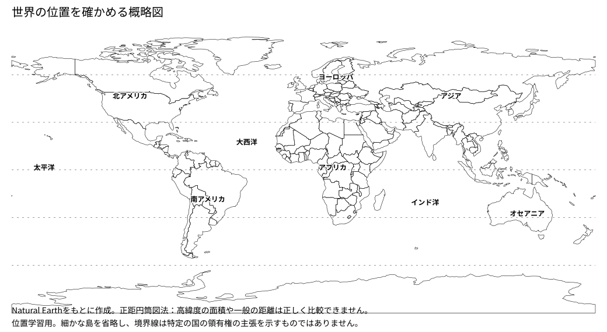
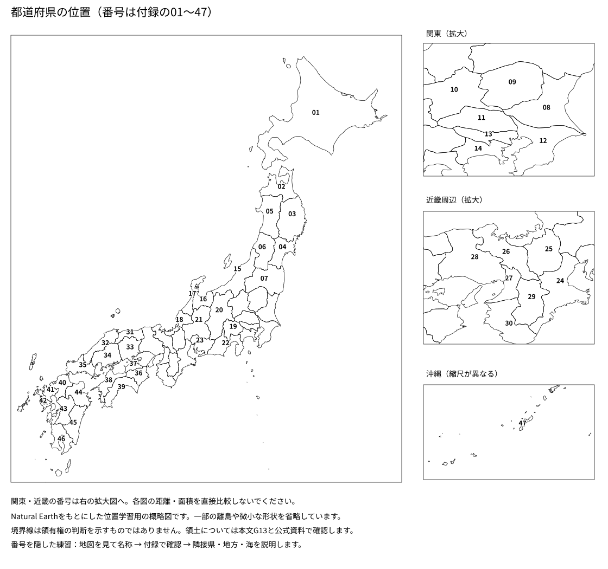

# 地図帳・47都道府県
位置を先に確かめてから名称と所在地を覚えます。番号はJISの順序に対応します。

|番号|都道府県|都道府県庁所在地|
|---|---|---|
|01|北海道|<ruby>札幌市<rp>（</rp><rt>さっぽろし</rt><rp>）</rp></ruby>|
|02|青森県|青森市|
|03|岩手県|盛岡市|
|04|宮城県|仙台市|
|05|秋田県|秋田市|
|06|山形県|山形市|
|07|福島県|福島市|
|08|<ruby>茨城県<rp>（</rp><rt>いばらきけん</rt><rp>）</rp></ruby>|水戸市|
|09|<ruby>栃木県<rp>（</rp><rt>とちぎけん</rt><rp>）</rp></ruby>|<ruby>宇都宮市<rp>（</rp><rt>うつのみやし</rt><rp>）</rp></ruby>|
|10|<ruby>群馬県<rp>（</rp><rt>ぐんまけん</rt><rp>）</rp></ruby>|前橋市|
|11|<ruby>埼玉県<rp>（</rp><rt>さいたまけん</rt><rp>）</rp></ruby>|さいたま市|
|12|千葉県|千葉市|
|13|東京都|新宿区|
|14|神奈川県|横浜市|
|15|<ruby>新潟県<rp>（</rp><rt>にいがたけん</rt><rp>）</rp></ruby>|新潟市|
|16|富山県|富山市|
|17|石川県|金沢市|
|18|福井県|福井市|
|19|山梨県|<ruby>甲府市<rp>（</rp><rt>こうふし</rt><rp>）</rp></ruby>|
|20|長野県|長野市|
|21|<ruby>岐阜県<rp>（</rp><rt>ぎふけん</rt><rp>）</rp></ruby>|岐阜市|
|22|静岡県|静岡市|
|23|愛知県|名古屋市|
|24|三重県|<ruby>津市<rp>（</rp><rt>つし</rt><rp>）</rp></ruby>|
|25|<ruby>滋賀県<rp>（</rp><rt>しがけん</rt><rp>）</rp></ruby>|<ruby>大津市<rp>（</rp><rt>おおつし</rt><rp>）</rp></ruby>|
|26|京都府|京都市|
|27|大阪府|大阪市|
|28|兵庫県|<ruby>神戸市<rp>（</rp><rt>こうべし</rt><rp>）</rp></ruby>|
|29|奈良県|奈良市|
|30|和歌山県|和歌山市|
|31|<ruby>鳥取県<rp>（</rp><rt>とっとりけん</rt><rp>）</rp></ruby>|鳥取市|
|32|島根県|松江市|
|33|岡山県|岡山市|
|34|広島県|広島市|
|35|山口県|山口市|
|36|徳島県|徳島市|
|37|香川県|高松市|
|38|<ruby>愛媛県<rp>（</rp><rt>えひめけん</rt><rp>）</rp></ruby>|松山市|
|39|高知県|高知市|
|40|福岡県|福岡市|
|41|佐賀県|佐賀市|
|42|長崎県|長崎市|
|43|熊本県|熊本市|
|44|<ruby>大分県<rp>（</rp><rt>おおいたけん</rt><rp>）</rp></ruby>|大分市|
|45|宮崎県|宮崎市|
|46|鹿児島県|鹿児島市|
|47|沖縄県|<ruby>那覇市<rp>（</rp><rt>なはし</rt><rp>）</rp></ruby>|

東京都は都庁の所在地として新宿区を記載しています。学校の地図帳・設問では東京や東京都区部と表す場合もあります。三重県はこの教材では近畿地方ですが、東海地方にも含める区分があります。
図は位置学習用の概略図です。世界図の面積、各拡大図相互の距離・面積は直接比較できません。一部の離島を省略し、境界は領有権の主張を示しません。
## 地図を使う練習
1. 都道府県名の列を隠し、番号の位置から名前を答えます。
2. 所在地の列を隠し、名称を答えます。
3. 県名を一つ選び、地方、近くの海、隣接県、関連する産業・気候を説明します。
4. 世界図では、大陸・海洋、主な国の位置、気候や産業とのつながりを本文へ戻って確認します。
原図：[Natural Earth](https://www.naturalearthdata.com/)（public domain）。都道府県の位置や地形を詳しく調べるときは[地理院地図](https://maps.gsi.go.jp/)を使います。
